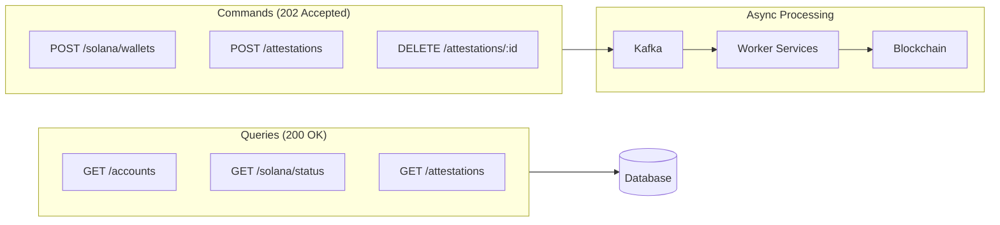

# API Reference

The Signum API is a RESTful API that returns JSON responses. It implements a **CQRS (Command Query Responsibility Segregation)** pattern for blockchain operations.

## Base URL

<Tabs>
  <Tab title="Production">
    ```
    https://api.signum.id
    ```
  </Tab>
  <Tab title="Development">
    ```
    http://localhost:5000
    ```
  </Tab>
</Tabs>

## CQRS Pattern

The API separates **commands** (write operations) from **queries** (read operations):



### Command Endpoints

Commands are processed asynchronously. The API returns immediately with a tracking ID:

| Endpoint | Command | Worker |
|----------|---------|--------|
| `POST /solana/wallets` | `CREATE_WALLET_PDA` | wallet-worker |
| `POST /attestations` | `CREATE_ATTESTATION` | attestation-worker |
| `DELETE /attestations/:id` | `REVOKE_ATTESTATION` | attestation-worker |

**Example Command Response:**

```json
{
  "walletId": "wallet_abc123",
  "pdaAddress": "5Gh7UuKrE7ePX4ghjZN2...",
  "status": "pending"
}
```

### Query Endpoints

Queries read from the database (eventually consistent with blockchain state):

| Endpoint | Description |
|----------|-------------|
| `GET /accounts` | List all chain identities |
| `GET /accounts/wallets` | Get embedded wallets |
| `GET /solana/status` | Get Solana wallet status |
| `GET /attestations` | List user's attestations |
| `GET /attestations/:id` | Get attestation by ID |

## Authentication

Most endpoints require authentication via Bearer token. Include the access token in the `Authorization` header:

```bash
curl https://api.signum.id/accounts \
  -H "Authorization: Bearer YOUR_ACCESS_TOKEN"
```

Obtain an access token by:
1. **Direct API**: `POST /auth/login` with email/password
2. **OAuth2**: `POST /oauth/token` with authorization code

## Response Format

### Success Response (200/201)

```json
{
  "user": {
    "id": "user_abc123",
    "email": "user@example.com"
  }
}
```

### Accepted Response (202)

For async commands:

```json
{
  "walletId": "wallet_abc123",
  "status": "pending",
  "message": "Wallet creation queued"
}
```

### Error Response

```json
{
  "error": "invalid_credentials",
  "message": "Email or password is incorrect"
}
```

## HTTP Status Codes

| Code | Description | Usage |
|------|-------------|-------|
| `200` | OK | Successful query or sync operation |
| `201` | Created | Resource created synchronously |
| `202` | Accepted | Command queued for async processing |
| `400` | Bad Request | Invalid parameters |
| `401` | Unauthorized | Missing or invalid token |
| `403` | Forbidden | Insufficient permissions |
| `404` | Not Found | Resource doesn't exist |
| `409` | Conflict | Resource already exists |
| `429` | Too Many Requests | Rate limited |
| `500` | Server Error | Something went wrong |

## Rate Limiting

API requests are rate-limited to prevent abuse:

| Endpoint | Anonymous | Authenticated |
|----------|-----------|---------------|
| `/auth/*` | 10/min | 100/min |
| `/oauth/*` | 50/min | 500/min |
| `/accounts/*` | - | 1000/min |
| `/solana/*` | - | 500/min |
| `/kyc/*` | - | 100/min |

Rate limit headers are included in responses:

```
X-RateLimit-Limit: 1000
X-RateLimit-Remaining: 999
X-RateLimit-Reset: 1706799600
```

## OpenAPI Specification

The complete OpenAPI 3.0 specification is available at:

| Endpoint | Description |
|----------|-------------|
| `GET /swagger` | Interactive Scalar UI |
| `GET /swagger/json` | Raw OpenAPI JSON |

## SDK Libraries

<CardGroup cols={2}>
  <Card title="TypeScript" icon="js" href="/sdks/typescript/installation">
    Official TypeScript/JavaScript SDK
  </Card>
  <Card title="Python" icon="python" href="/sdks/python">
    Python SDK (coming soon)
  </Card>
</CardGroup>

## API Sections

<CardGroup cols={3}>
  <Card title="Authentication" icon="key" href="/api-reference/auth/register">
    Direct API authentication for embedded apps
  </Card>
  <Card title="OAuth2" icon="lock" href="/api-reference/oauth/authorize">
    OAuth2/OIDC flows for third-party apps
  </Card>
  <Card title="Accounts" icon="user" href="/api-reference/accounts/get-accounts">
    Unified chain identity management
  </Card>
  <Card title="Solana" icon="sun" href="/api-reference/solana/status">
    Solana PDA wallet operations (CQRS)
  </Card>
  <Card title="KYC" icon="id-card" href="/api-reference/kyc/status">
    Identity verification endpoints
  </Card>
  <Card title="Discovery" icon="compass" href="/api-reference/discovery/openid-config">
    OIDC discovery and JWKS
  </Card>
</CardGroup>

## Endpoint Summary

### Authentication (`/auth/*`)

| Method | Endpoint | Description | Response |
|--------|----------|-------------|----------|
| POST | `/auth/register` | Create new user account | 201 |
| POST | `/auth/login` | Authenticate user | 200 |
| POST | `/auth/refresh` | Refresh access token | 200 |
| GET | `/auth/me` | Get current user | 200 |
| POST | `/auth/logout` | Invalidate tokens | 200 |

### OAuth2/OIDC (`/oauth/*`)

| Method | Endpoint | Description | Response |
|--------|----------|-------------|----------|
| GET | `/oauth/authorize` | Start OAuth flow | 302 |
| POST | `/oauth/token` | Exchange code for tokens | 200 |
| GET | `/oauth/userinfo` | Get user profile | 200 |
| POST | `/oauth/revoke` | Revoke token | 200 |

### Accounts (`/accounts/*`)

| Method | Endpoint | Description | Response |
|--------|----------|-------------|----------|
| GET | `/accounts` | Get all chain identities | 200 |
| POST | `/accounts/wallets` | Create embedded wallets | 201 |
| POST | `/accounts/wallets/sync` | Sync from Privy | 200 |
| POST | `/accounts/link/evm` | Link external EVM wallet | 201 |

### Solana (`/solana/*`) - CQRS

| Method | Endpoint | Description | Response |
|--------|----------|-------------|----------|
| GET | `/solana/status` | Get wallet status | 200 |
| POST | `/solana/wallets` | Create PDA wallet | **202** |
| GET | `/solana/attestations/:wallet` | Get attestations | 200 |

### KYC (`/kyc/*`)

| Method | Endpoint | Description | Response |
|--------|----------|-------------|----------|
| GET | `/kyc/status` | Get KYC status | 200 |
| POST | `/kyc/initiate` | Start verification | 200 |
| POST | `/kyc/webhook/:provider` | Provider webhook | 200 |

### Discovery (`/.well-known/*`)

| Method | Endpoint | Description | Response |
|--------|----------|-------------|----------|
| GET | `/.well-known/openid-configuration` | OIDC discovery | 200 |
| GET | `/.well-known/jwks.json` | JSON Web Key Set | 200 |
