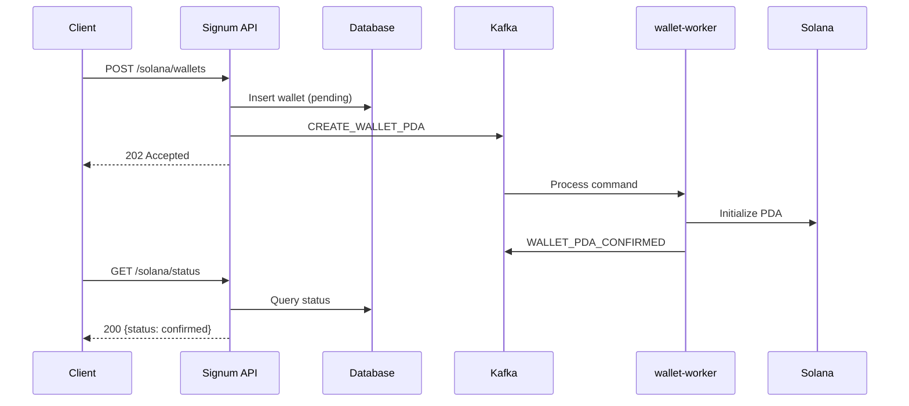

# Create PDA Wallet

Queue the creation of a Program Derived Address (PDA) custody wallet for the authenticated user on Solana.

<Warning>
  This is a **command endpoint** that returns `202 Accepted`. The wallet is created asynchronously by the `wallet-worker` service. Poll `GET /solana/status` to check when it's confirmed.
</Warning>

## CQRS Flow



## Authorization

<ParamField header="Authorization" type="string" required>
  Bearer token from login or OAuth2 flow.
</ParamField>

## Request Body

<ParamField body="embeddedWalletAddress" type="string">
  Optional. The Privy embedded wallet address to associate with the PDA.
</ParamField>

## Response (202 Accepted)

<ResponseField name="walletId" type="string">
  Unique identifier for tracking the wallet creation.
</ResponseField>

<ResponseField name="pdaAddress" type="string">
  Derived PDA wallet address.
</ResponseField>

<ResponseField name="status" type="string">
  Always "pending" for new requests.
</ResponseField>

<RequestExample>
```bash cURL
curl -X POST https://api.signum.id/solana/wallets \
  -H "Authorization: Bearer YOUR_ACCESS_TOKEN" \
  -H "Content-Type: application/json" \
  -d '{"embeddedWalletAddress": "7Kx2BvPL8tqRxyz..."}'
```

```typescript TypeScript
// Create wallet (returns 202)
const response = await fetch('https://api.signum.id/solana/wallets', {
  method: 'POST',
  headers: {
    Authorization: `Bearer ${accessToken}`,
    'Content-Type': 'application/json',
  },
  body: JSON.stringify({
    embeddedWalletAddress: '7Kx2BvPL8tqRxyz...',
  }),
});

const { walletId, pdaAddress, status } = await response.json();
console.log('Wallet ID:', walletId);
console.log('Status:', status); // "pending"

// Poll for confirmation
const pollStatus = async () => {
  const statusRes = await fetch('https://api.signum.id/solana/status', {
    headers: { Authorization: `Bearer ${accessToken}` },
  });
  return statusRes.json();
};

let confirmed = false;
while (!confirmed) {
  await new Promise(resolve => setTimeout(resolve, 2000));
  const status = await pollStatus();
  if (status.status === 'confirmed') {
    console.log('Wallet ready!', status.address);
    confirmed = true;
  } else if (status.status === 'failed') {
    throw new Error('Wallet creation failed');
  }
}
```
</RequestExample>

<ResponseExample>
```json 202 Accepted
{
  "walletId": "wallet_abc123xyz",
  "pdaAddress": "5Gh7UuKrE7ePX4ghjZN2abcdef1234567890abcdef",
  "status": "pending"
}
```

```json 409 Conflict
{
  "error": "wallet_exists",
  "message": "Solana PDA wallet already exists for this user"
}
```

```json 401 Unauthorized
{
  "error": "unauthorized",
  "message": "Invalid or expired access token"
}
```
</ResponseExample>

## Status Polling

After receiving `202 Accepted`, poll the status endpoint to check confirmation:

```typescript
// Using SDK
import { SignumClient } from '@signum/sdk';

const signum = new SignumClient({ baseUrl: 'https://api.signum.id' });

// Create and wait for confirmation
const result = await signum.solana.createWallet(accessToken);
const confirmed = await signum.solana.waitForConfirmation(
  accessToken,
  result.walletId,
  { timeout: 30000, pollInterval: 2000 }
);

console.log('Confirmed wallet:', confirmed.address);
```

## Error Handling

| Error | Code | Description |
|-------|------|-------------|
| `wallet_exists` | 409 | User already has a PDA wallet |
| `unauthorized` | 401 | Invalid or expired token |
| `rate_limited` | 429 | Too many requests |
| `server_error` | 500 | Internal error (retry later) |
