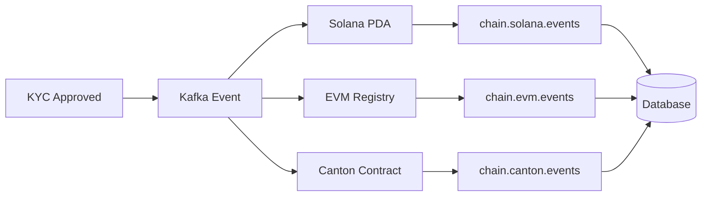
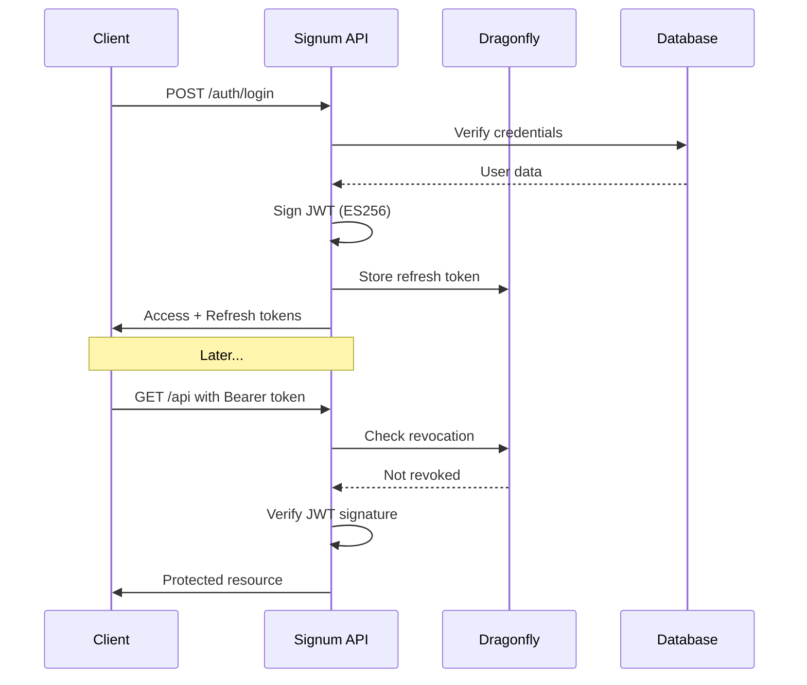

# Architecture

Signum is designed as an enterprise-grade identity layer with event-driven multi-chain synchronization.

## System Overview

```
┌─────────────────────────────────────────────────────────────────────────────┐
│                           SIGNUM IDENTITY PLATFORM                           │
├─────────────────────────────────────────────────────────────────────────────┤
│                                                                             │
│  ┌─────────────────────────────────────────────────────────────────────┐   │
│  │                        API GATEWAY (Elysia/Bun)                      │   │
│  │  • OAuth2/OIDC endpoints    • Direct auth API    • Rate limiting    │   │
│  └─────────────────────────────────────────────────────────────────────┘   │
│                                      │                                      │
│          ┌───────────────────────────┼───────────────────────────┐         │
│          │                           │                           │         │
│  ┌───────▼───────┐           ┌───────▼───────┐           ┌───────▼───────┐ │
│  │   Identity    │           │      KYC      │           │  Attestation  │ │
│  │   Service     │           │    Service    │           │    Bridge     │ │
│  │               │           │               │           │               │ │
│  │ • User CRUD   │           │ • Sumsub      │           │ • Cross-chain │ │
│  │ • JWT signing │           │ • Verification│           │ • Kafka sync  │ │
│  │ • Sessions    │           │ • Webhooks    │           │ • Revocation  │ │
│  └───────────────┘           └───────────────┘           └───────────────┘ │
│          │                           │                           │         │
│  ┌───────┴───────────────────────────┴───────────────────────────┴───────┐ │
│  │                         EVENT BUS (Kafka/Redpanda)                     │ │
│  │  kyc.status.changed │ attestation.created │ chain.*.events            │ │
│  └────────────────────────────────────────────────────────────────────────┘ │
│                                      │                                      │
│          ┌───────────────────────────┼───────────────────────────┐         │
│          │                           │                           │         │
│  ┌───────▼───────┐           ┌───────▼───────┐           ┌───────▼───────┐ │
│  │    SOLANA     │           │      EVM      │           │    CANTON     │ │
│  │   (Helius)    │           │    (viem)     │           │  (Ledger API) │ │
│  │               │           │               │           │               │ │
│  │ • PDAs        │           │ • ERC-3643    │           │ • DAML        │ │
│  │ • Token 2022  │           │ • Multi-chain │           │ • Party IDs   │ │
│  │ • Hooks       │           │ • Registry    │           │ • Privacy     │ │
│  └───────────────┘           └───────────────┘           └───────────────┘ │
│                                                                             │
└─────────────────────────────────────────────────────────────────────────────┘
```

## Core Components

### API Layer

The API is built with **Elysia** on the **Bun** runtime for maximum performance:

| Endpoint Group | Purpose |
|----------------|---------|
| `/auth/*` | Direct API authentication (embedded mode) |
| `/oauth/*` | OAuth2/OIDC flows for third-party apps |
| `/accounts/*` | Unified chain identity management |
| `/solana/*` | Solana-specific PDA operations |
| `/kyc/*` | KYC verification and status |
| `/.well-known/*` | OIDC discovery and JWKS |

### Identity Service

Manages user lifecycle and JWT signing:

- **ES256 signing** with rotating key pairs
- **Multi-chain claims** embedded in tokens
- **Refresh token rotation** with secure storage
- **Session management** via Dragonfly cache

### KYC Service

Pluggable KYC provider integration:

```typescript
interface KycProvider {
  createApplicant(user: User): Promise<ApplicantId>;
  getVerificationStatus(applicantId: string): Promise<KycStatus>;
  generateAccessToken(applicantId: string): Promise<string>;
}
```

Currently supports:
- **Sumsub** for production
- **Mock provider** for development

### Attestation Bridge

Event-driven cross-chain synchronization:



## Infrastructure

### Dragonfly (Cache)

High-performance Redis-compatible cache:

| Use Case | Key Pattern | TTL |
|----------|-------------|-----|
| Rate limiting | `ratelimit:{endpoint}:{ip}` | Window size |
| Authorization codes | `auth_code:{code}` | 10 minutes |
| Token revocation | `revoked:{jti}` | Token expiry |
| OAuth state | `oauth_state:{state}` | 15 minutes |
| JWKS cache | `jwks:current` | 1 hour |

**Why Dragonfly?**
- 25x higher throughput than Redis
- 80% lower memory footprint
- Multi-threaded architecture
- Full Redis API compatibility

### Kafka/Redpanda (Events)

Event streaming for service communication:

| Topic | Producer | Consumers |
|-------|----------|-----------|
| `kyc.status.changed` | KYC Service | Chain adapters |
| `attestation.created` | Attestation Bridge | All chains |
| `attestation.revoked` | Attestation Bridge | All chains |
| `chain.solana.events` | Helius Listener | Database sync |
| `chain.evm.events` | EVM Adapter | Database sync |
| `chain.canton.events` | Canton Adapter | Database sync |

### Supabase (Database)

PostgreSQL with Row-Level Security:

```sql
-- Core tables
users                    -- User accounts
user_chain_identities    -- Linked wallet addresses
kyc_verifications        -- KYC status and metadata
attestation_anchors      -- Cross-chain attestation records
oauth_clients            -- Registered applications
refresh_tokens           -- Token storage
```

## Chain Integrations

### Solana via Helius

[Helius](https://helius.dev) provides enhanced Solana RPC:

- **WebSocket streaming** for real-time PDA monitoring
- **Priority Fee API** for reliable transaction landing
- **Enhanced RPC** for complex queries

```typescript
// Helius WebSocket subscription
const ws = new WebSocket(`wss://atlas-mainnet.helius-rpc.com?api-key=${API_KEY}`);
ws.send(JSON.stringify({
  jsonrpc: "2.0",
  method: "accountSubscribe",
  params: [PDA_ADDRESS, { encoding: "jsonParsed" }]
}));
```

The **Helius Listener** service:
1. Monitors registered PDAs for changes
2. Publishes events to Kafka
3. Enables real-time attestation sync

### EVM via viem

Multi-chain EVM support:

| Network | Chain ID | Registry Contract |
|---------|----------|-------------------|
| Ethereum Mainnet | 1 | `0x...` |
| Polygon | 137 | `0x...` |
| Arbitrum One | 42161 | `0x...` |
| Base | 8453 | `0x...` |
| Optimism | 10 | `0x...` |

### Canton Network

Enterprise blockchain with privacy:

- **DAML contracts** for tokenized assets
- **Party-based identity** for institutional privacy
- **Ledger API** for event streaming

## Security Architecture

### Authentication Flow



### Token Security

| Token Type | Lifetime | Storage | Rotation |
|------------|----------|---------|----------|
| Access Token | 1 hour | Client memory | On expiry |
| Refresh Token | 30 days | Secure cookie | Per use |
| ID Token | 1 hour | Client memory | With access |

### Rate Limiting

Sliding window rate limiting via Dragonfly:

| Endpoint | Anonymous | Authenticated |
|----------|-----------|---------------|
| `/auth/*` | 10/min | 100/min |
| `/oauth/*` | 50/min | 500/min |
| `/api/*` | 100/min | 1000/min |

## Deployment

### Development

```bash
# Start all infrastructure
cd infra
make start-all

# Runs:
# - Supabase (localhost:54321)
# - Dragonfly (localhost:6379)
# - Redpanda (localhost:9092)
# - Redpanda Console (localhost:8080)

# Start app service
cd ../app
bun run dev
```

### Production

Recommended deployment:

| Component | Platform | Scaling |
|-----------|----------|---------|
| API | Fly.io / Railway | Horizontal |
| Cache | Dragonfly Cloud | Single node (25x Redis) |
| Database | Supabase Cloud | Managed |
| Events | Confluent Cloud | Managed |
