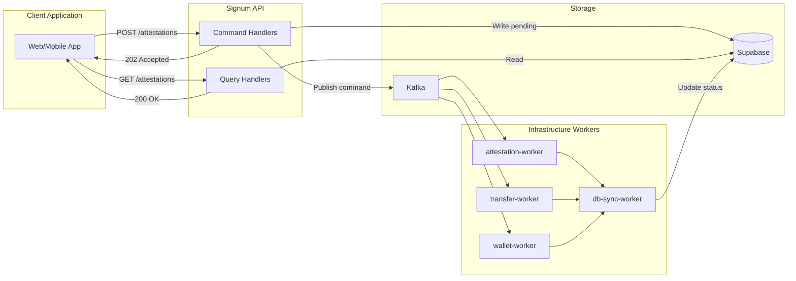
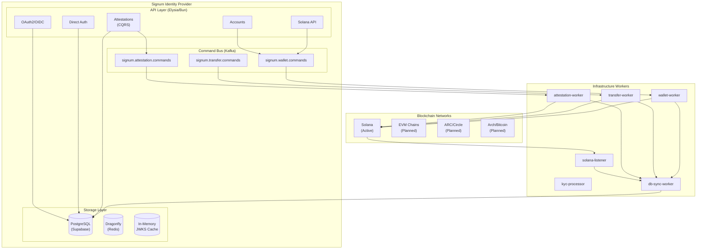
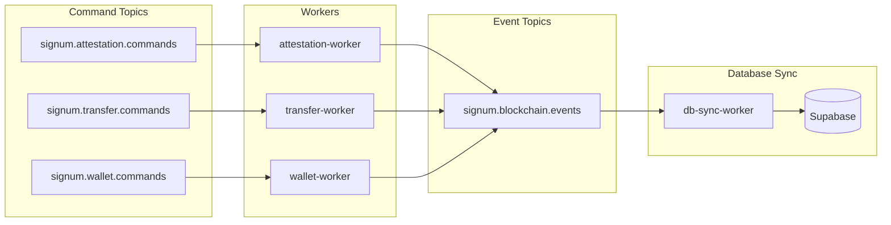
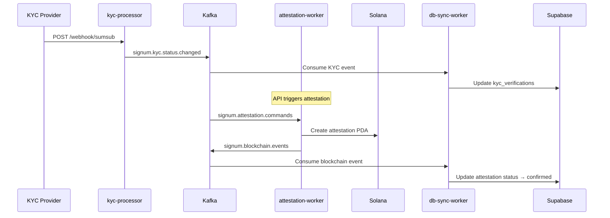
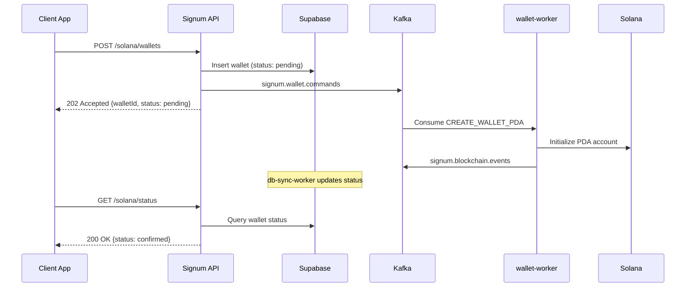
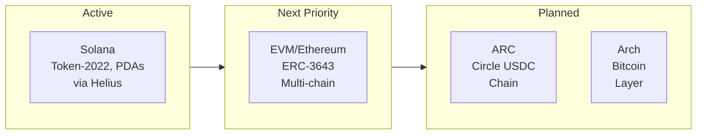
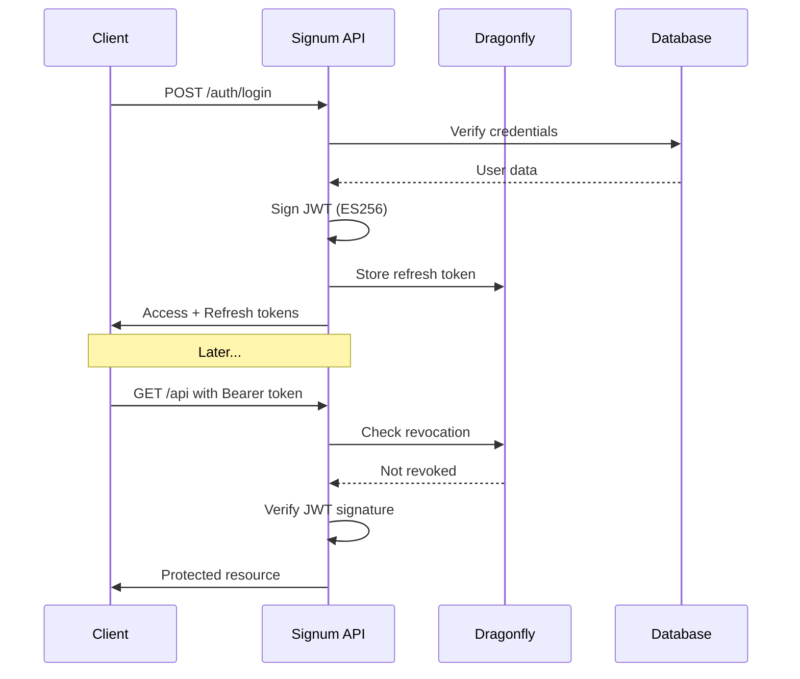

# Architecture

Signum implements a **CQRS (Command Query Responsibility Segregation)** pattern with Kafka-based event-driven architecture for reliable multi-chain identity management.

## CQRS Overview

The architecture separates write operations (commands) from read operations (queries):

| Operation | HTTP Response | Behavior |
|-----------|---------------|----------|
| **Commands** | `202 Accepted` | Writes to DB, publishes Kafka command, async on-chain execution |
| **Queries** | `200 OK` | Reads directly from database (eventually consistent) |



## System Architecture



## Core Components

### API Layer

The API is built with **Elysia** on the **Bun** runtime for maximum performance:

| Endpoint Group | Purpose | Pattern |
|----------------|---------|---------|
| `/auth/*` | Direct API authentication | Sync (200) |
| `/oauth/*` | OAuth2/OIDC flows | Sync (200) |
| `/accounts/*` | Chain identity management | Sync (200) |
| `/solana/wallets` | PDA wallet creation | **Async (202)** |
| `/attestations` | KYC attestation management | **Async (202)** |
| `/kyc/*` | KYC verification status | Sync (200) |
| `/.well-known/*` | OIDC discovery and JWKS | Sync (200) |

### Command Endpoints (202 Accepted)

These endpoints queue operations for async processing:

| Endpoint | Command Topic | Worker |
|----------|---------------|--------|
| `POST /solana/wallets` | `signum.wallet.commands` | wallet-worker |
| `POST /attestations` | `signum.attestation.commands` | attestation-worker |
| `DELETE /attestations/:id` | `signum.attestation.commands` | attestation-worker |
| `POST /transfers` | `signum.transfer.commands` | transfer-worker |

### Query Endpoints (200 OK)

These endpoints read directly from the database:

| Endpoint | Description |
|----------|-------------|
| `GET /accounts` | List all chain identities |
| `GET /accounts/wallets` | Get embedded wallets |
| `GET /solana/status` | Get Solana wallet status |
| `GET /attestations` | List user's attestations |
| `GET /attestations/:id` | Get attestation by ID |

## Worker Services



| Worker | Input | Output | Responsibility |
|--------|-------|--------|----------------|
| **kyc-processor** | KYC webhooks | `signum.kyc.status.changed` | Process KYC provider webhooks |
| **attestation-worker** | `signum.attestation.commands` | `signum.blockchain.events` | Create/revoke on-chain attestations |
| **transfer-worker** | `signum.transfer.commands` | `signum.blockchain.events` | Execute compliant token transfers |
| **wallet-worker** | `signum.wallet.commands` | `signum.blockchain.events` | Initialize PDA wallets on-chain |
| **db-sync-worker** | All event topics | Database writes | Sync blockchain state to database |
| **solana-listener** | Helius webhooks | `chain.solana.events` | Monitor on-chain account changes |

## Event Flow Examples

### KYC to On-Chain Attestation



### Wallet PDA Initialization



## Infrastructure

### Kafka Topics

| Topic | Producer | Consumer | Purpose |
|-------|----------|----------|---------|
| `signum.kyc.status.changed` | kyc-processor | db-sync-worker | KYC verification updates |
| `signum.attestation.commands` | Signum API | attestation-worker | Create/revoke attestations |
| `signum.transfer.commands` | Signum API | transfer-worker | Execute compliant transfers |
| `signum.wallet.commands` | Signum API | wallet-worker | Initialize PDA wallets |
| `signum.blockchain.events` | All workers | db-sync-worker | Confirmed/failed tx events |
| `chain.solana.events` | solana-listener | db-sync-worker | On-chain account changes |

### Dragonfly (Cache)

High-performance Redis-compatible cache:

| Use Case | Key Pattern | TTL |
|----------|-------------|-----|
| Rate limiting | `ratelimit:{endpoint}:{ip}` | Window size |
| Authorization codes | `auth_code:{code}` | 10 minutes |
| Token revocation | `revoked:{jti}` | Token expiry |
| OAuth state | `oauth_state:{state}` | 15 minutes |
| JWKS cache | `jwks:current` | 1 hour |

### Supabase (Database)

PostgreSQL with Row-Level Security:

```sql
-- Core tables
users                    -- User accounts
user_chain_identities    -- Linked wallet addresses
kyc_verifications        -- KYC status and metadata
solana_wallets           -- PDA wallet records with status
solana_attestations      -- Attestation records with status
oauth_clients            -- Registered applications
refresh_tokens           -- Token storage
```

## Chain Integration Roadmap



| Priority | Chain | Status | Technology |
|----------|-------|--------|------------|
| 1 | **Solana** | Active | Token-2022, Transfer Hooks, PDAs via Helius |
| 2 | **EVM/Ethereum** | Next | ERC-3643 Identity Registry (Ethereum, Polygon, Base) |
| 3 | **ARC** | Planned | Circle USDC chain integration |
| 4 | **Arch** | Planned | Bitcoin layer integration |

### Solana via Helius

[Helius](https://helius.dev) provides enhanced Solana RPC:

- **WebSocket streaming** for real-time PDA monitoring
- **Priority Fee API** for reliable transaction landing
- **Enhanced RPC** for complex queries

The **solana-listener** service monitors PDAs and publishes events to Kafka.

### EVM (Planned)

Multi-chain EVM support using viem:

| Network | Chain ID | Status |
|---------|----------|--------|
| Ethereum Mainnet | 1 | Planned |
| Polygon | 137 | Planned |
| Base | 8453 | Planned |
| Arbitrum One | 42161 | Planned |

## Security Architecture

### Authentication Flow



### Token Security

| Token Type | Lifetime | Storage | Rotation |
|------------|----------|---------|----------|
| Access Token | 1 hour | Client memory | On expiry |
| Refresh Token | 30 days | Secure cookie | Per use |
| ID Token | 1 hour | Client memory | With access |

### Rate Limiting

Sliding window rate limiting via Dragonfly:

| Endpoint | Anonymous | Authenticated |
|----------|-----------|---------------|
| `/auth/*` | 10/min | 100/min |
| `/oauth/*` | 50/min | 500/min |
| `/api/*` | 100/min | 1000/min |

## Deployment

### Development

```bash
# Start infrastructure
cd infra && make start-all

# Runs:
# - Supabase (localhost:54321)
# - Dragonfly (localhost:6379)
# - Redpanda (localhost:9092)

# Start API
cd ../app && bun dev
```

### Production

| Component | Platform | Scaling |
|-----------|----------|---------|
| API | Fly.io / Railway | Horizontal |
| Workers | Docker / Kubernetes | Per topic |
| Cache | Dragonfly Cloud | Single node |
| Database | Supabase Cloud | Managed |
| Events | Confluent Cloud | Managed |
