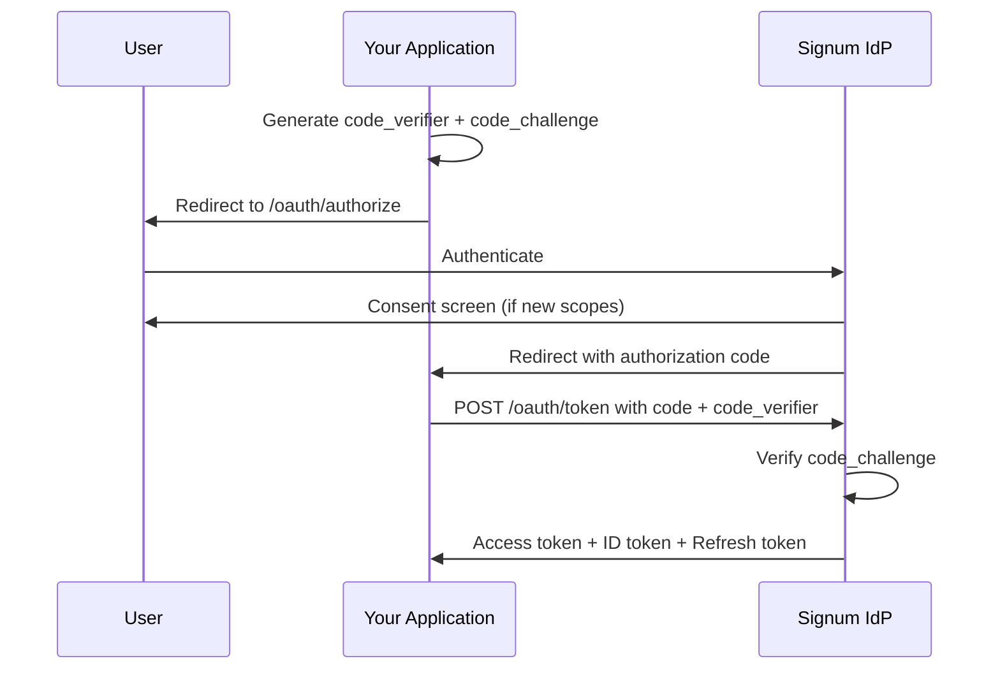

# OAuth2 Flows

Signum implements the OAuth2 Authorization Code flow with PKCE (Proof Key for Code Exchange) for secure third-party authentication.

## Authorization Code Flow with PKCE

This is the recommended flow for all client types, including single-page applications and mobile apps.



## Step 1: Generate PKCE Parameters

Before redirecting, generate cryptographic parameters:

<CodeGroup>
```typescript TypeScript
import crypto from 'crypto';

// Generate a random code verifier (43-128 characters)
function generateCodeVerifier(): string {
  return crypto.randomBytes(32)
    .toString('base64url')
    .slice(0, 64);
}

// Generate code challenge from verifier (S256)
async function generateCodeChallenge(verifier: string): Promise<string> {
  const hash = crypto.createHash('sha256')
    .update(verifier)
    .digest();
  return Buffer.from(hash).toString('base64url');
}

// Usage
const codeVerifier = generateCodeVerifier();
const codeChallenge = await generateCodeChallenge(codeVerifier);
const state = crypto.randomBytes(16).toString('hex');

// Store verifier and state for callback validation
sessionStorage.setItem('code_verifier', codeVerifier);
sessionStorage.setItem('oauth_state', state);
```

```python Python
import hashlib
import base64
import secrets

def generate_code_verifier() -> str:
    return secrets.token_urlsafe(32)[:64]

def generate_code_challenge(verifier: str) -> str:
    digest = hashlib.sha256(verifier.encode()).digest()
    return base64.urlsafe_b64encode(digest).decode().rstrip('=')

code_verifier = generate_code_verifier()
code_challenge = generate_code_challenge(code_verifier)
state = secrets.token_hex(16)

# Store in session for callback validation
session['code_verifier'] = code_verifier
session['oauth_state'] = state
```
</CodeGroup>

## Step 2: Redirect to Authorization Endpoint

Construct the authorization URL and redirect the user:

```
GET https://api.signum.id/oauth/authorize
```

| Parameter | Required | Description |
|-----------|----------|-------------|
| `response_type` | Yes | Must be `code` |
| `client_id` | Yes | Your application's client ID |
| `redirect_uri` | Yes | Must match registered URI exactly |
| `scope` | Yes | Space-separated list of scopes |
| `state` | Recommended | Random string to prevent CSRF |
| `code_challenge` | Yes | Base64url-encoded SHA256 of code_verifier |
| `code_challenge_method` | Yes | Must be `S256` |

**Example URL:**

```
https://api.signum.id/oauth/authorize?
  response_type=code&
  client_id=app_abc123&
  redirect_uri=https://yourapp.com/callback&
  scope=openid%20profile%20email%20chain:read&
  state=xyzABC123&
  code_challenge=E9Melhoa2OwvFrEMTJguCHaoeK1t8URWbuGJSstw-cM&
  code_challenge_method=S256
```

## Step 3: Handle Callback

After authentication, Signum redirects back with an authorization code:

```
GET https://yourapp.com/callback?code=AUTH_CODE&state=xyzABC123
```

<Warning>
  Always validate the `state` parameter matches what you stored before proceeding.
</Warning>

```typescript
// Handle callback
const urlParams = new URLSearchParams(window.location.search);
const code = urlParams.get('code');
const returnedState = urlParams.get('state');

// Validate state
const storedState = sessionStorage.getItem('oauth_state');
if (returnedState !== storedState) {
  throw new Error('Invalid state parameter - possible CSRF attack');
}

// Get stored code_verifier
const codeVerifier = sessionStorage.getItem('code_verifier');
```

## Step 4: Exchange Code for Tokens

Exchange the authorization code for tokens:

```
POST https://api.signum.id/oauth/token
Content-Type: application/json
```

**Request Body:**

```json
{
  "grant_type": "authorization_code",
  "client_id": "app_abc123",
  "code": "AUTH_CODE_FROM_CALLBACK",
  "redirect_uri": "https://yourapp.com/callback",
  "code_verifier": "ORIGINAL_CODE_VERIFIER"
}
```

**Response:**

```json
{
  "access_token": "eyJhbGciOiJFUzI1NiIs...",
  "token_type": "Bearer",
  "expires_in": 3600,
  "refresh_token": "rt_abc123...",
  "id_token": "eyJhbGciOiJFUzI1NiIs...",
  "scope": "openid profile email chain:read"
}
```

## Step 5: Use the Access Token

Include the access token in API requests:

```bash
curl https://api.signum.id/accounts \
  -H "Authorization: Bearer ACCESS_TOKEN"
```

## Refresh Token Flow

When the access token expires, use the refresh token:

```
POST https://api.signum.id/oauth/token
Content-Type: application/json
```

```json
{
  "grant_type": "refresh_token",
  "client_id": "app_abc123",
  "refresh_token": "rt_abc123..."
}
```

**Response:**

```json
{
  "access_token": "eyJhbGciOiJFUzI1NiIs...",
  "token_type": "Bearer",
  "expires_in": 3600,
  "refresh_token": "rt_new456...",
  "id_token": "eyJhbGciOiJFUzI1NiIs..."
}
```

<Info>
  Refresh tokens are rotated on each use. Always store the new refresh token from the response.
</Info>

## Error Responses

Authorization errors redirect back with error parameters:

```
https://yourapp.com/callback?
  error=access_denied&
  error_description=User+denied+access&
  state=xyzABC123
```

| Error | Description |
|-------|-------------|
| `invalid_request` | Missing required parameter |
| `unauthorized_client` | Client not authorized for this grant |
| `access_denied` | User denied the authorization request |
| `unsupported_response_type` | Response type not supported |
| `invalid_scope` | Requested scope is invalid |
| `server_error` | Unexpected server error |

Token endpoint errors return JSON:

```json
{
  "error": "invalid_grant",
  "error_description": "Authorization code expired or invalid"
}
```
