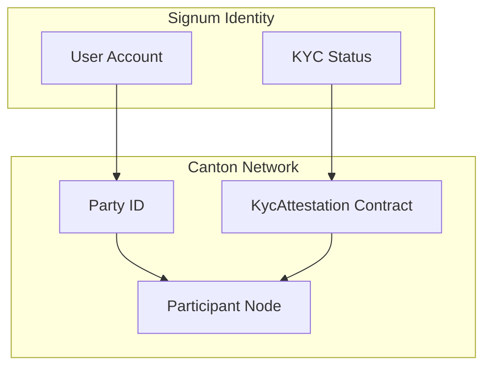
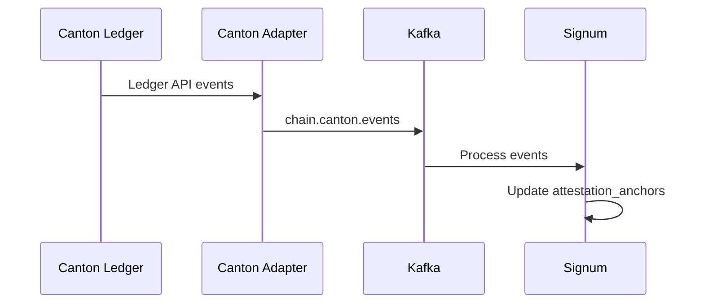
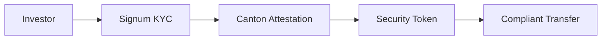

# Canton Network Integration

Canton Network is an enterprise blockchain designed for institutional use cases. Signum integrates with Canton to provide compliant identity for tokenized assets and regulated DeFi.

## Why Canton?

| Feature | Benefit |
|---------|---------|
| **Privacy** | Transactions visible only to participants |
| **Finality** | Immediate, deterministic finality |
| **Interoperability** | Connect with other Canton participants |
| **Compliance** | Built for regulated environments |
| **DAML** | Type-safe smart contracts |

## Canton Identity Model

On Canton, identity is based on **Party IDs**:

```
party::signum::user-abc123
```

A party represents a legal entity or individual and is the basis for all access control in DAML contracts.

## Architecture



## DAML Contracts

### KycAttestation Template

```daml
template KycAttestation
  with
    issuer : Party        -- Signum's party
    subject : Party       -- User's party
    verified : Bool
    level : Text          -- "basic" | "enhanced" | "institutional"
    verifiedAt : Time
    expiresAt : Time
  where
    signatory issuer
    observer subject
    
    choice Revoke : ()
      controller issuer
      do return ()
    
    choice Renew : ContractId KycAttestation
      with
        newExpiry : Time
      controller issuer
      do create this with expiresAt = newExpiry
```

### TokenTransfer Template

```daml
template TokenTransfer
  with
    sender : Party
    recipient : Party
    token : ContractId Token
    amount : Decimal
    complianceCheck : ContractId KycAttestation
  where
    signatory sender
    observer recipient
    
    choice Execute : ContractId Token
      controller sender
      do
        -- Verify KYC attestation
        attestation <- fetch complianceCheck
        assertMsg "KYC not verified" attestation.verified
        
        -- Execute transfer
        exercise token Transfer with amount, recipient
```

## API Endpoints

### Create Canton Party

Allocate a Canton party for the user:

```bash
POST /accounts/canton
Authorization: Bearer YOUR_TOKEN
```

**Response:**

```json
{
  "canton": {
    "partyId": "party::signum::user-abc123",
    "participant": "participant::signum",
    "createdAt": "2026-01-15T12:00:00Z"
  }
}
```

### Get Canton Identity

```bash
GET /accounts
Authorization: Bearer YOUR_TOKEN
```

**Response includes:**

```json
{
  "chains": {
    "canton": {
      "partyId": "party::signum::user-abc123",
      "participant": "participant::signum",
      "attestation": {
        "contractId": "00abc123...",
        "verified": true,
        "level": "enhanced"
      }
    }
  }
}
```

## TypeScript SDK

```typescript
import { SignumClient } from '@signum/sdk';

const signum = new SignumClient({ baseUrl: 'https://api.signum.id' });

// Create Canton party
const canton = await signum.accounts.createCanton(accessToken);
console.log('Party ID:', canton.partyId);

// Get full account with Canton identity
const account = await signum.accounts.getAll(accessToken);
console.log('Canton:', account.chains.canton);
```

## Event Streaming

Canton events are streamed via the Ledger API and published to Kafka:



### Event Types

| Event | Description |
|-------|-------------|
| `KycAttestation.Created` | New attestation anchored |
| `KycAttestation.Revoked` | Attestation revoked |
| `KycAttestation.Renewed` | Attestation expiry extended |

## Privacy Model

Canton's privacy model is fundamentally different from public blockchains:

<CardGroup cols={2}>
  <Card title="Transaction Privacy" icon="eye-slash">
    Only transaction participants see transaction data. No global visibility.
  </Card>
  <Card title="Party Privacy" icon="user-secret">
    Party relationships are not publicly visible. Only known to relevant participants.
  </Card>
</CardGroup>

### Attestation Visibility

| Entity | Can See Attestation |
|--------|---------------------|
| Signum (issuer) | Yes |
| User (subject) | Yes |
| Other parties | Only if given observer rights |

## Use Cases

### Tokenized Securities



### Institutional DeFi

Canton enables institutional participation in DeFi with:
- **Know Your Counterparty**: Verified identities for all participants
- **Regulatory Compliance**: Attestations meet AML/KYC requirements
- **Privacy**: Counterparty identities not exposed to third parties

## Integration Requirements

To use Canton integration:

1. **Participant Access**: Your organization needs access to a Canton participant node
2. **Party Allocation**: Signum allocates parties under its participant
3. **Contract Templates**: Deploy Signum's DAML templates to your environment

<Note>
  Canton integration requires enterprise coordination. Contact [support@signum.id](mailto:support@signum.id) for setup.
</Note>
