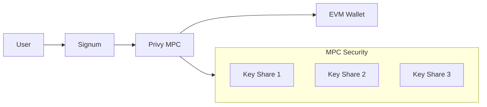

# EVM Integration

Signum supports EVM-compatible chains including Ethereum, Polygon, Arbitrum, Base, and Optimism. Users can link existing wallets or create new embedded wallets.

## Supported Networks

| Network | Chain ID | Status |
|---------|----------|--------|
| Ethereum Mainnet | 1 | Production |
| Polygon | 137 | Production |
| Arbitrum One | 42161 | Production |
| Base | 8453 | Production |
| Optimism | 10 | Production |
| Sepolia (testnet) | 11155111 | Development |

## Wallet Types

### Embedded Wallets

Created via Privy with MPC key management:



**Benefits:**
- No seed phrase to manage
- Cross-device recovery via email
- Same address on all EVM chains
- Transaction signing via API

### External Wallets

Link existing wallets (MetaMask, Ledger, etc.) via signature verification:

```typescript
// 1. User signs a message
const message = `Link wallet to Signum: ${userId}\nTimestamp: ${Date.now()}`;
const signature = await wallet.signMessage(message);

// 2. Submit to Signum
await fetch('/accounts/evm/link', {
  method: 'POST',
  headers: { Authorization: `Bearer ${token}` },
  body: JSON.stringify({
    address: wallet.address,
    signature,
    message,
  }),
});
```

## API Endpoints

### Create Embedded Wallet

Create a new Privy-managed wallet:

```bash
POST /accounts/wallets
Authorization: Bearer YOUR_TOKEN
```

**Response:**

```json
{
  "evm": {
    "address": "0x1234...5678",
    "type": "embedded",
    "chains": [1, 137, 42161, 8453, 10]
  },
  "solana": {
    "address": "5Gh7UuKrE7ePX4ghjZN2...",
    "type": "embedded"
  }
}
```

### Link External Wallet

```bash
POST /accounts/evm/link
Authorization: Bearer YOUR_TOKEN
Content-Type: application/json

{
  "address": "0xabcd...ef01",
  "signature": "0x...",
  "message": "Link wallet to Signum: user_abc123\nTimestamp: 1706796000000"
}
```

### Set Primary Wallet

```bash
POST /accounts/evm/primary
Authorization: Bearer YOUR_TOKEN
Content-Type: application/json

{
  "address": "0xabcd...ef01"
}
```

### Get Wallet Balance

```bash
GET /accounts/evm/0x1234...5678/balance?chain=1
Authorization: Bearer YOUR_TOKEN
```

**Response:**

```json
{
  "address": "0x1234...5678",
  "chainId": 1,
  "balance": {
    "native": "1.5",
    "symbol": "ETH",
    "usd": 3750.00
  }
}
```

## Attestation Architecture

EVM attestations use ERC-3643 compatible Identity Registry contracts:

```solidity
interface IIdentityRegistry {
    function isVerified(address wallet) external view returns (bool);
    function getIdentity(address wallet) external view returns (
        bool verified,
        uint8 level,
        uint256 verifiedAt,
        uint256 expiresAt
    );
}
```

### Registry Addresses

| Network | Registry Contract |
|---------|-------------------|
| Ethereum | `0x...` (coming soon) |
| Polygon | `0x...` (coming soon) |
| Arbitrum | `0x...` (coming soon) |
| Base | `0x...` (coming soon) |

## TypeScript SDK

```typescript
import { SignumClient } from '@signum/sdk';

const signum = new SignumClient({ baseUrl: 'https://api.signum.id' });

// Create embedded wallets
const wallets = await signum.accounts.createWallets(accessToken);
console.log('EVM:', wallets.evm.address);
console.log('Solana:', wallets.solana.address);

// Link external wallet
await signum.accounts.linkEvm(accessToken, {
  address: '0xabcd...ef01',
  signature: signedMessage,
  message: originalMessage,
});

// Get balance
const balance = await signum.accounts.getEvmBalance(
  accessToken,
  '0x1234...5678',
  1 // Ethereum mainnet
);
```

## Multi-Chain Operations

Embedded wallets have the same address on all EVM chains:

```typescript
// Same address, different chains
const chains = [1, 137, 42161, 8453, 10];

for (const chainId of chains) {
  const balance = await signum.accounts.getEvmBalance(token, address, chainId);
  console.log(`Chain ${chainId}: ${balance.native} ${balance.symbol}`);
}
```

## Security Model

<CardGroup cols={2}>
  <Card title="Embedded Wallets" icon="shield">
    MPC key sharding via Privy. No single point of failure. Recovery via email verification.
  </Card>
  <Card title="External Wallets" icon="wallet">
    User maintains full control. Signum only stores public address after signature verification.
  </Card>
</CardGroup>

### Transaction Signing (Embedded)

For embedded wallets, Signum can sign transactions on behalf of users:

```typescript
// Request transaction signing
const tx = await signum.evm.signTransaction(accessToken, {
  chainId: 137,
  to: '0xrecipient...',
  value: '1000000000000000000', // 1 MATIC
  data: '0x',
});

// Submit to network
const hash = await provider.sendTransaction(tx);
```

<Note>
  Transaction signing requires additional scopes and may require user confirmation depending on transaction type.
</Note>
