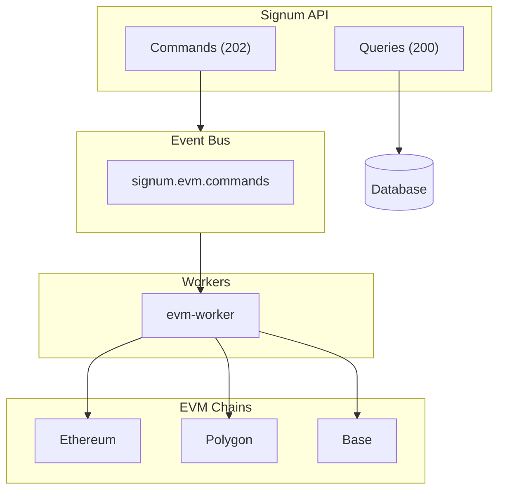
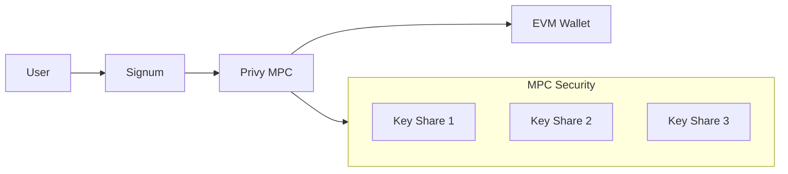

# EVM Integration

<Note>
  EVM chain integration is currently in development. This documentation describes the planned implementation.
</Note>

Signum will support EVM-compatible chains including Ethereum, Polygon, Arbitrum, and Base. Users can link existing wallets or create new embedded wallets.

## Roadmap Status

| Network | Chain ID | Status |
|---------|----------|--------|
| Ethereum Mainnet | 1 | **Planned** |
| Polygon | 137 | **Planned** |
| Base | 8453 | **Planned** |
| Arbitrum One | 42161 | **Planned** |
| Optimism | 10 | Future |
| Sepolia (testnet) | 11155111 | Development |

## Planned Architecture



## Wallet Types

### Embedded Wallets

Will be created via Privy with MPC key management:



**Benefits:**
- No seed phrase to manage
- Cross-device recovery via email
- Same address on all EVM chains
- Transaction signing via API

### External Wallets

Link existing wallets (MetaMask, Ledger, etc.) via signature verification:

```typescript
// 1. User signs a message
const message = `Link wallet to Signum: ${userId}\nTimestamp: ${Date.now()}`;
const signature = await wallet.signMessage(message);

// 2. Submit to Signum
await fetch('/accounts/evm/link', {
  method: 'POST',
  headers: { Authorization: `Bearer ${token}` },
  body: JSON.stringify({
    address: wallet.address,
    signature,
    message,
  }),
});
```

## Planned API Endpoints

### Create Embedded Wallet

Create a new Privy-managed wallet:

```bash
POST /accounts/wallets
Authorization: Bearer YOUR_TOKEN
```

**Response:**

```json
{
  "evm": {
    "address": "0x1234...5678",
    "type": "embedded",
    "chains": [1, 137, 8453]
  },
  "solana": {
    "address": "5Gh7UuKrE7ePX4ghjZN2...",
    "type": "embedded"
  }
}
```

### Link External Wallet

```bash
POST /accounts/evm/link
Authorization: Bearer YOUR_TOKEN
Content-Type: application/json

{
  "address": "0xabcd...ef01",
  "signature": "0x...",
  "message": "Link wallet to Signum: user_abc123\nTimestamp: 1706796000000"
}
```

## Attestation Architecture

EVM attestations will use ERC-3643 compatible Identity Registry contracts:

```solidity
interface IIdentityRegistry {
    function isVerified(address wallet) external view returns (bool);
    function getIdentity(address wallet) external view returns (
        bool verified,
        uint8 level,
        uint256 verifiedAt,
        uint256 expiresAt
    );
}
```

### Registry Contracts

| Network | Registry Contract | Status |
|---------|-------------------|--------|
| Ethereum | TBD | Planned |
| Polygon | TBD | Planned |
| Base | TBD | Planned |

## TypeScript SDK (Planned)

```typescript
import { SignumClient } from '@signum/sdk';

const signum = new SignumClient({ baseUrl: 'https://api.signum.id' });

// Create embedded wallets
const wallets = await signum.accounts.createWallets(accessToken);
console.log('EVM:', wallets.evm.address);

// Link external wallet
await signum.accounts.linkEvm(accessToken, {
  address: '0xabcd...ef01',
  signature: signedMessage,
  message: originalMessage,
});

// Get balance
const balance = await signum.accounts.getEvmBalance(
  accessToken,
  '0x1234...5678',
  1 // Ethereum mainnet
);
```

## Security Model

<CardGroup cols={2}>
  <Card title="Embedded Wallets" icon="shield">
    MPC key sharding via Privy. No single point of failure. Recovery via email verification.
  </Card>
  <Card title="External Wallets" icon="wallet">
    User maintains full control. Signum only stores public address after signature verification.
  </Card>
</CardGroup>

## Current Status

EVM integration is the next priority after Solana stabilization:

| Phase | Description | Status |
|-------|-------------|--------|
| Design | Architecture and contracts | Complete |
| Contracts | ERC-3643 registry deployment | In Progress |
| API | Endpoint implementation | Planned |
| Workers | evm-worker service | Planned |
| Testing | Integration tests | Planned |

<Info>
  Want early access to EVM integration? Contact [support@signum.id](mailto:support@signum.id).
</Info>
