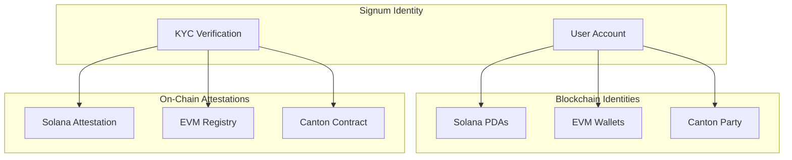
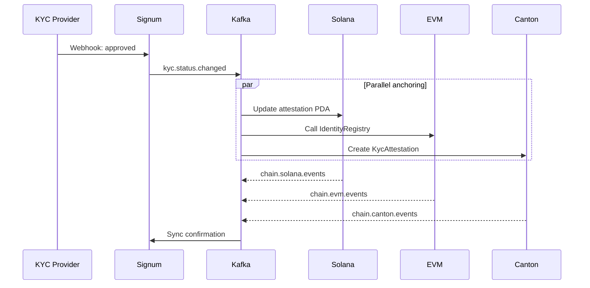

# Multi-Chain Identity

Signum provides a unified identity that spans multiple blockchain networks. Each user has linked identities on Solana, EVM chains, and Canton Network, all tied to their single Signum account.

## The Identity Model



## Chain Identity Types

### Solana - Program Derived Addresses (PDAs)

On Solana, wallet addresses are derived deterministically from email hashes:

```typescript
// PDA derivation (no private key!)
const [walletPda] = PublicKey.findProgramAddressSync(
  [Buffer.from("wallet"), emailHash],
  SIGNUM_PROGRAM_ID
);
```

**Benefits:**
- No seed phrase management
- Deterministic - same email always derives same address
- Program-controlled for compliance enforcement
- Token 2022 transfer hooks for KYC gating

### EVM - Linked Wallets

On EVM chains, users link their existing wallets or create new embedded wallets via Privy:

| Wallet Type | Description |
|-------------|-------------|
| **Embedded** | Created by Signum via Privy. MPC-secured, no seed phrase. |
| **External** | User's existing wallet (MetaMask, etc.) linked via signature. |

Attestations are stored in ERC-3643 compatible Identity Registries.

### Canton - Party IDs

Canton Network uses party-based identity for institutional privacy:

```
party::signum::user-abc123
```

DAML contracts enforce KYC requirements at the protocol level.

## Unified Account View

The `/accounts` endpoint returns all chain identities:

```json
{
  "user": {
    "id": "user_abc123",
    "email": "user@example.com",
    "displayName": "John Doe"
  },
  "chains": {
    "solana": {
      "pda": {
        "address": "5Gh7UuKrE7ePX4ghjZN2...",
        "type": "custody",
        "attestation": {
          "verified": true,
          "anchoredAt": "2026-01-15T12:00:00Z"
        }
      },
      "linked": [
        {
          "address": "9Kx2BvPL8tqR...",
          "type": "external",
          "linkedAt": "2026-01-10T09:00:00Z"
        }
      ]
    },
    "evm": {
      "embedded": {
        "address": "0x1234...5678",
        "chains": [1, 137, 42161, 8453, 10]
      },
      "linked": [
        {
          "address": "0xabcd...ef01",
          "chains": [1, 137],
          "primary": true
        }
      ]
    },
    "canton": {
      "partyId": "party::signum::user-abc123",
      "participant": "participant::signum"
    }
  },
  "kyc": {
    "verified": true,
    "level": "enhanced",
    "verifiedAt": "2026-01-15T12:00:00Z"
  }
}
```

## Cross-Chain Attestations

When a user passes KYC, attestations are created on all linked chains:



## Chain Capabilities

| Feature | Solana | EVM | Canton |
|---------|--------|-----|--------|
| **Wallet Type** | PDA (custodial) | EOA (self-custody) | Party ID |
| **Attestation** | Program account | Registry contract | DAML contract |
| **Transfer Hook** | Token 2022 | ERC-3643 | Workflow |
| **Privacy** | Public | Public | Private |
| **Gas** | Low (~$0.001) | Variable | None |

## Next Steps

<CardGroup cols={3}>
  <Card title="Solana" icon="sun" href="/chains/solana">
    PDA derivation and attestation PDAs
  </Card>
  <Card title="EVM" icon="ethereum" href="/chains/evm">
    Multi-chain wallet management
  </Card>
  <Card title="Canton" icon="building-columns" href="/chains/canton">
    Enterprise privacy with DAML
  </Card>
</CardGroup>
