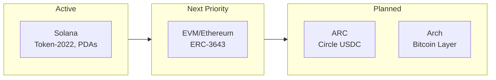
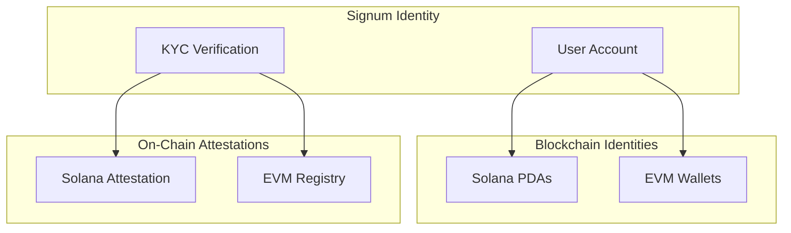

# Multi-Chain Identity

Signum provides a unified identity that spans multiple blockchain networks. Each user has linked identities across supported chains, all tied to their single Signum account.

## Chain Support Roadmap



| Priority | Chain | Status | Description |
|----------|-------|--------|-------------|
| 1 | **Solana** | Active | Token-2022, Transfer Hooks, PDAs via Helius |
| 2 | **EVM/Ethereum** | Next | ERC-3643 Identity Registry (Ethereum, Polygon, Base) |
| 3 | **ARC** | Planned | Circle USDC chain integration |
| 4 | **Arch** | Planned | Bitcoin layer integration |

## The Identity Model



## Chain Identity Types

### Solana - Program Derived Addresses (PDAs)

On Solana, wallet addresses are derived deterministically from user IDs:

```typescript
// PDA derivation (no private key!)
const [walletPda] = PublicKey.findProgramAddressSync(
  [Buffer.from("wallet"), userIdHash],
  SIGNUM_PROGRAM_ID
);
```

**Benefits:**
- No seed phrase management
- Deterministic - same user always derives same address
- Program-controlled for compliance enforcement
- Token-2022 transfer hooks for KYC gating

### EVM - Linked Wallets (Planned)

On EVM chains, users link existing wallets or create embedded wallets via Privy:

| Wallet Type | Description |
|-------------|-------------|
| **Embedded** | Created by Signum via Privy. MPC-secured, no seed phrase. |
| **External** | User's existing wallet (MetaMask, etc.) linked via signature. |

Attestations will be stored in ERC-3643 compatible Identity Registries.

### ARC - Circle USDC Chain (Planned)

Circle's ARC chain for USDC:

- Native USDC transfers
- Institutional compliance built-in
- Cross-chain USDC bridging

### Arch - Bitcoin Layer (Planned)

Bitcoin layer integration:

- Bitcoin-native identity attestations
- Ordinals/Runes compatibility
- Cross-chain verification

## Unified Account View

The `/accounts` endpoint returns all chain identities:

```json
{
  "user": {
    "id": "user_abc123",
    "email": "user@example.com",
    "displayName": "John Doe"
  },
  "chains": {
    "solana": {
      "pda": {
        "address": "5Gh7UuKrE7ePX4ghjZN2...",
        "type": "custody",
        "status": "confirmed",
        "attestation": {
          "verified": true,
          "anchoredAt": "2026-01-15T12:00:00Z"
        }
      },
      "embedded": {
        "address": "7Kx2BvPL8tqR...",
        "type": "embedded",
        "createdAt": "2026-01-10T09:00:00Z"
      }
    },
    "evm": {
      "embedded": {
        "address": "0x1234...5678",
        "chains": [1, 137, 8453]
      },
      "linked": [
        {
          "address": "0xabcd...ef01",
          "chains": [1, 137],
          "primary": true
        }
      ]
    }
  },
  "kyc": {
    "verified": true,
    "level": "enhanced",
    "verifiedAt": "2026-01-15T12:00:00Z"
  }
}
```

## Cross-Chain Attestations (CQRS Pattern)

When a user passes KYC, attestations are created asynchronously on linked chains:

```mermaid
sequenceDiagram
    participant KYC as KYC Provider
    participant API as Signum API
    participant Kafka
    participant AttWorker as attestation-worker
    participant Solana
    participant DbSync as db-sync-worker
    participant DB as Database

    KYC->>API: Webhook: approved
    API->>Kafka: signum.kyc.status.changed
    API-->>KYC: 200 OK
    
    Note over API: User triggers attestation
    API->>DB: Insert attestation (pending)
    API->>Kafka: signum.attestation.commands
    API-->>User: 202 Accepted
    
    Kafka->>AttWorker: Consume command
    AttWorker->>Solana: Create attestation PDA
    AttWorker->>Kafka: signum.blockchain.events
    
    Kafka->>DbSync: Consume event
    DbSync->>DB: Update status → confirmed
```



## Chain Capabilities

| Feature | Solana | EVM (Planned) |
|---------|--------|---------------|
| **Wallet Type** | PDA (custodial) | EOA (self-custody) |
| **Attestation** | Program account | Registry contract |
| **Transfer Hook** | Token-2022 | ERC-3643 |
| **Privacy** | Public | Public |
| **Gas** | Low (~$0.001) | Variable |
| **Status** | Active | Next Priority |

## Next Steps

<CardGroup cols={2}>
  <Card title="Solana" icon="sun" href="/chains/solana">
    PDA derivation and attestation PDAs
  </Card>
  <Card title="EVM" icon="ethereum" href="/chains/evm">
    Multi-chain wallet management (planned)
  </Card>
</CardGroup>
