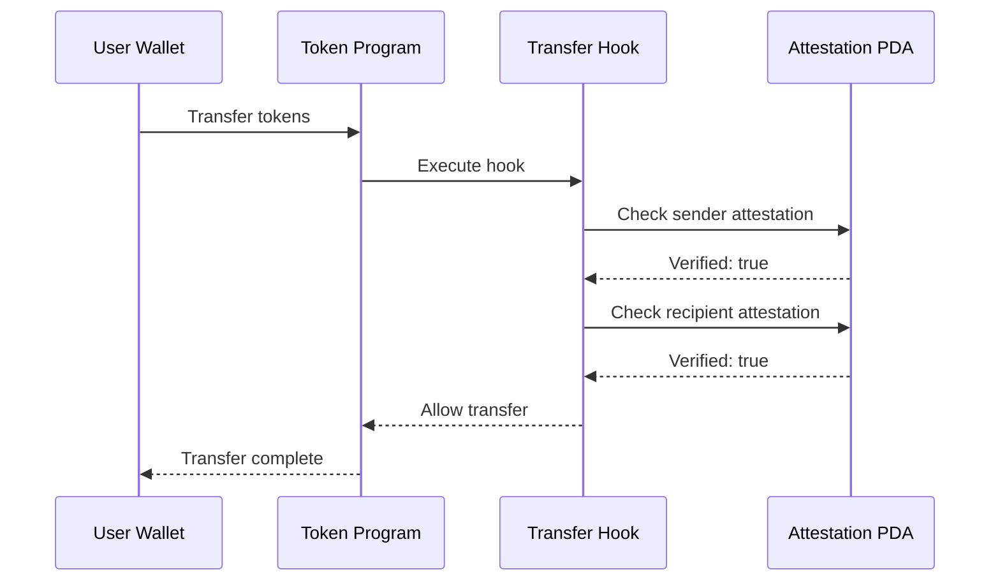

# Solana Integration

Signum uses Solana's Program Derived Addresses (PDAs) to create deterministic wallet addresses tied to user identities. No seed phrases, no key management—the program itself controls the wallet.

## How PDAs Work

PDAs are addresses derived from a combination of seeds and a program ID. They have no private key—only the program can sign transactions.

```
┌─────────────────────────────────────────────────────────┐
│                    PDA Derivation                        │
├─────────────────────────────────────────────────────────┤
│                                                         │
│   Email: user@example.com                               │
│                    ↓                                    │
│   SHA-256 Hash: 0xabcdef...                            │
│                    ↓                                    │
│   Seeds: ["wallet", emailHash]                          │
│                    ↓                                    │
│   findProgramAddressSync(seeds, PROGRAM_ID)             │
│                    ↓                                    │
│   PDA: 5Gh7UuKrE7ePX4ghjZN2...                         │
│                                                         │
└─────────────────────────────────────────────────────────┘
```

## PDA Types

Signum creates two PDAs per user:

### 1. Wallet PDA

The user's custody wallet for holding tokens:

```typescript
import { getWalletPDA, hashEmailAsync } from '@signum/solana-sdk';

const emailHash = await hashEmailAsync('user@example.com');
const [walletPda, bump] = getWalletPDA(emailHash, PROGRAM_ID);

console.log('Wallet PDA:', walletPda.toBase58());
// Output: 5Gh7UuKrE7ePX4ghjZN2...
```

### 2. Attestation PDA

Stores the user's KYC attestation status:

```typescript
import { getKycStatusPDA } from '@signum/solana-sdk';

const [attestationPda] = getKycStatusPDA(emailHash, PROGRAM_ID);

console.log('Attestation PDA:', attestationPda.toBase58());
// Output: 9Kx2BvPL8tqR...
```

## Attestation Account Structure

```rust
pub struct KycAttestation {
    /// Bump seed for PDA derivation
    pub bump: u8,
    /// Email hash (32 bytes)
    pub email_hash: [u8; 32],
    /// Whether KYC is verified
    pub verified: bool,
    /// Verification level (basic, enhanced, institutional)
    pub level: KycLevel,
    /// Timestamp of verification
    pub verified_at: i64,
    /// Expiration timestamp
    pub expires_at: i64,
    /// Issuer (Signum's public key)
    pub issuer: Pubkey,
}
```

## Token 2022 Transfer Hooks

Signum uses Token 2022 transfer hooks for compliance enforcement:



If either party lacks a valid attestation, the transfer is rejected.

## API Endpoints

### Get Solana Status

Check if the user has a Solana PDA:

```bash
GET /solana/status
Authorization: Bearer YOUR_TOKEN
```

**Response:**

```json
{
  "hasWallet": true,
  "wallet": {
    "address": "5Gh7UuKrE7ePX4ghjZN2...",
    "type": "pda",
    "createdAt": "2026-01-15T12:00:00Z"
  },
  "attestation": {
    "verified": true,
    "level": "enhanced",
    "anchoredAt": "2026-01-15T12:05:00Z"
  }
}
```

### Create PDA Wallet

Create the user's Solana PDA:

```bash
POST /solana/wallets
Authorization: Bearer YOUR_TOKEN
```

**Response:**

```json
{
  "wallet": {
    "address": "5Gh7UuKrE7ePX4ghjZN2...",
    "type": "pda"
  },
  "transaction": {
    "signature": "5Gh7...signature",
    "slot": 123456789
  }
}
```

### Link External Wallet

Link a user's existing Solana wallet:

```bash
POST /solana/link
Authorization: Bearer YOUR_TOKEN
Content-Type: application/json

{
  "address": "ExternalWalletAddress...",
  "signature": "SignedMessage...",
  "message": "Link wallet to Signum: user_abc123"
}
```

## TypeScript SDK

```typescript
import { SignumClient } from '@signum/sdk';

const signum = new SignumClient({ baseUrl: 'https://api.signum.id' });

// Get Solana status
const status = await signum.solana.getStatus(accessToken);
console.log(status.wallet.address);

// Create PDA wallet
const wallet = await signum.solana.createWallet(accessToken);
console.log('Created:', wallet.wallet.address);

// Derive PDA locally (no RPC needed)
import { getWalletPDA, hashEmailAsync } from '@signum/solana-sdk';
const emailHash = await hashEmailAsync('user@example.com');
const [pda] = getWalletPDA(emailHash, PROGRAM_ID);
```

## Helius Integration

Signum uses [Helius](https://helius.dev) for real-time PDA monitoring:

| Feature | Purpose |
|---------|---------|
| **Enhanced RPC** | Reliable transaction submission |
| **WebSocket** | Real-time account change notifications |
| **Priority Fees** | Optimal transaction landing |

The Helius Listener service monitors PDAs and publishes events to Kafka for cross-chain sync.

## Security Considerations

<Warning>
  PDAs are controlled entirely by the program. Ensure you trust the program before depositing funds.
</Warning>

- **No private key**: PDAs cannot be compromised via key theft
- **Program authority**: Only the Signum program can sign transactions
- **Recovery**: Wallet recovery is tied to identity verification, not seed phrases
- **Revocation**: Attestations can be revoked, freezing the wallet
