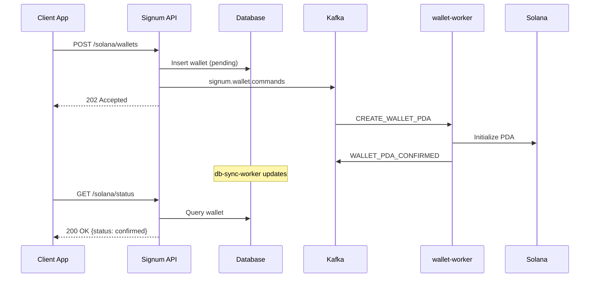
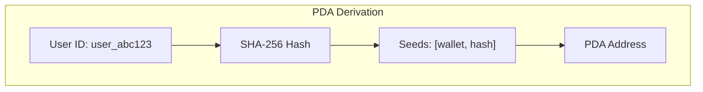
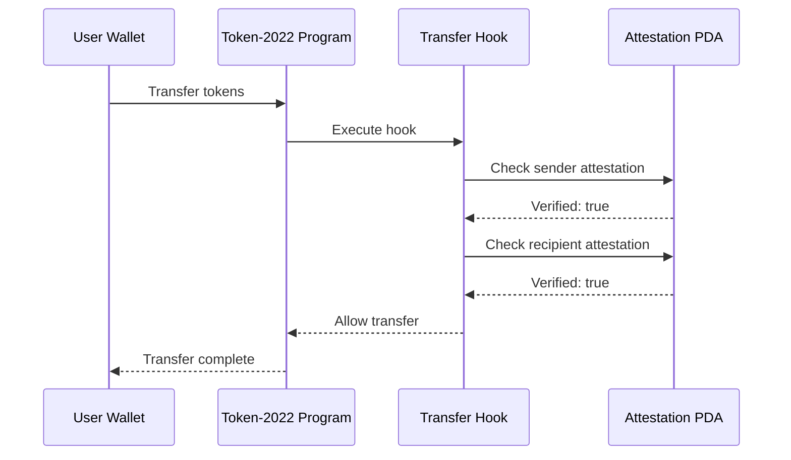
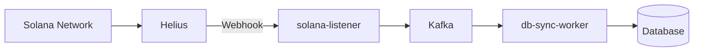

# Solana Integration

Signum uses Solana's Program Derived Addresses (PDAs) to create deterministic wallet addresses tied to user identities. No seed phrases, no key management—the program itself controls the wallet.

<Info>
  Solana is the **active** chain integration. All blockchain operations follow the CQRS pattern with async processing.
</Info>

## CQRS Pattern

Solana operations use Command Query Responsibility Segregation:

| Operation | HTTP Response | Processing |
|-----------|---------------|------------|
| `POST /solana/wallets` | **202 Accepted** | Async via wallet-worker |
| `GET /solana/status` | 200 OK | Database read |
| `GET /solana/attestations/:wallet` | 200 OK | Database read |



## How PDAs Work

PDAs are addresses derived from a combination of seeds and a program ID. They have no private key—only the program can sign transactions.



```typescript
// PDA derivation (deterministic, no RPC needed)
const [walletPda, bump] = PublicKey.findProgramAddressSync(
  [Buffer.from("wallet"), userIdHash],
  SIGNUM_PROGRAM_ID
);
```

## PDA Types

Signum creates two PDAs per user:

### 1. Wallet PDA

The user's custody wallet for holding tokens:

```typescript
import { derivePdaWallet } from '@signum/solana-sdk';

const { address, bump } = derivePdaWallet('user_abc123');
console.log('Wallet PDA:', address);
// Output: 5Gh7UuKrE7ePX4ghjZN2...
```

### 2. Attestation PDA

Stores the user's KYC attestation status:

```typescript
import { deriveAttestationPda } from '@signum/solana-sdk';

const { address } = deriveAttestationPda(walletAddress);
console.log('Attestation PDA:', address);
// Output: 9Kx2BvPL8tqR...
```

## Attestation Account Structure

```rust
pub struct KycAttestation {
    /// Bump seed for PDA derivation
    pub bump: u8,
    /// User ID hash (32 bytes)
    pub user_id_hash: [u8; 32],
    /// Whether KYC is verified
    pub verified: bool,
    /// Verification level (basic, enhanced, institutional)
    pub level: KycLevel,
    /// Country code (ISO 3166-1 alpha-2)
    pub country_code: [u8; 2],
    /// Timestamp of verification
    pub verified_at: i64,
    /// Expiration timestamp
    pub expires_at: i64,
    /// Issuer (Signum's authority public key)
    pub issuer: Pubkey,
}
```

## Token 2022 Transfer Hooks

Signum uses Token-2022 transfer hooks for compliance enforcement:



If either party lacks a valid attestation, the transfer is rejected.

## API Endpoints

### Get Solana Status (Query)

Check the user's Solana wallet status:

```bash
GET /solana/status
Authorization: Bearer YOUR_TOKEN
```

**Response:**

```json
{
  "exists": true,
  "address": "5Gh7UuKrE7ePX4ghjZN2...",
  "status": "confirmed",
  "embeddedWallet": "7Kx2BvPL8tqR...",
  "attestationPda": "9Kx2BvPL8tqR...",
  "createdAt": "2026-01-15T12:00:00Z"
}
```

| Status | Description |
|--------|-------------|
| `pending` | PDA creation queued |
| `confirmed` | PDA initialized on-chain |
| `failed` | Initialization failed |
| `unknown` | No wallet record |

### Create PDA Wallet (Command)

Create the user's Solana PDA wallet:

```bash
POST /solana/wallets
Authorization: Bearer YOUR_TOKEN
Content-Type: application/json

{
  "embeddedWalletAddress": "7Kx2BvPL8tqR..."
}
```

**Response (202 Accepted):**

```json
{
  "walletId": "wallet_abc123",
  "pdaAddress": "5Gh7UuKrE7ePX4ghjZN2...",
  "status": "pending"
}
```

<Note>
  The wallet creation is processed asynchronously. Poll `GET /solana/status` to check when it's confirmed.
</Note>

### Get Attestations (Query)

Get attestations for a wallet address:

```bash
GET /solana/attestations/5Gh7UuKrE7ePX4ghjZN2...
Authorization: Bearer YOUR_TOKEN
```

**Response:**

```json
{
  "attestations": [
    {
      "pdaAddress": "9Kx2BvPL8tqR...",
      "verified": true,
      "kycLevel": 2,
      "countryCode": "US",
      "anchored": true,
      "anchoredAt": "2026-01-15T12:05:00Z",
      "expiresAt": "2027-01-15T12:05:00Z"
    }
  ]
}
```

### Link External Wallet

Link a user's existing Solana wallet:

```bash
POST /solana/link
Authorization: Bearer YOUR_TOKEN
Content-Type: application/json

{
  "address": "ExternalWalletAddress...",
  "signature": "SignedMessage...",
  "message": "Link wallet to Signum: user_abc123"
}
```

## TypeScript SDK

```typescript
import { SignumClient } from '@signum/sdk';

const signum = new SignumClient({ baseUrl: 'https://api.signum.id' });

// Get Solana status
const status = await signum.solana.getStatus(accessToken);
console.log(status.address, status.status);

// Create PDA wallet (returns 202)
const result = await signum.solana.createWallet(accessToken, {
  embeddedWalletAddress: '7Kx2BvPL8tqR...'
});
console.log('Wallet ID:', result.walletId);
console.log('Status:', result.status); // "pending"

// Poll for confirmation
const confirmed = await signum.solana.waitForConfirmation(
  accessToken,
  result.walletId,
  { timeout: 30000 }
);
```

### Local PDA Derivation

Derive PDAs locally without RPC calls:

```typescript
import { derivePdaWallet, deriveAttestationPda } from '@signum/solana-sdk';

// Derive wallet PDA
const wallet = derivePdaWallet('user_abc123');
console.log('PDA:', wallet.address);
console.log('Bump:', wallet.bump);

// Derive attestation PDA from wallet
const attestation = deriveAttestationPda(wallet.address);
console.log('Attestation PDA:', attestation.address);
```

## Helius Integration

Signum uses [Helius](https://helius.dev) for Solana infrastructure:

| Feature | Purpose |
|---------|---------|
| **Enhanced RPC** | Reliable transaction submission |
| **WebSocket** | Real-time account change notifications |
| **Priority Fees** | Optimal transaction landing |
| **Webhooks** | Event-driven updates |

The **solana-listener** service monitors PDAs via Helius and publishes events to Kafka.



## Security Considerations

<Warning>
  PDAs are controlled entirely by the program. Ensure you trust the program before depositing funds.
</Warning>

| Aspect | Description |
|--------|-------------|
| **No private key** | PDAs cannot be compromised via key theft |
| **Program authority** | Only the Signum program can sign transactions |
| **Recovery** | Wallet recovery is tied to identity verification |
| **Revocation** | Attestations can be revoked, freezing transfers |

## Kafka Commands & Events

### Commands (API → Worker)

| Command | Description |
|---------|-------------|
| `CREATE_WALLET_PDA` | Initialize PDA wallet on-chain |
| `CREATE_ATTESTATION` | Create KYC attestation PDA |
| `REVOKE_ATTESTATION` | Revoke existing attestation |

### Events (Worker → db-sync)

| Event | Description |
|-------|-------------|
| `WALLET_PDA_CONFIRMED` | PDA successfully initialized |
| `WALLET_PDA_FAILED` | Initialization failed after retries |
| `ATTESTATION_CONFIRMED` | Attestation created on-chain |
| `ATTESTATION_FAILED` | Attestation creation failed |
