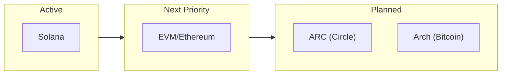
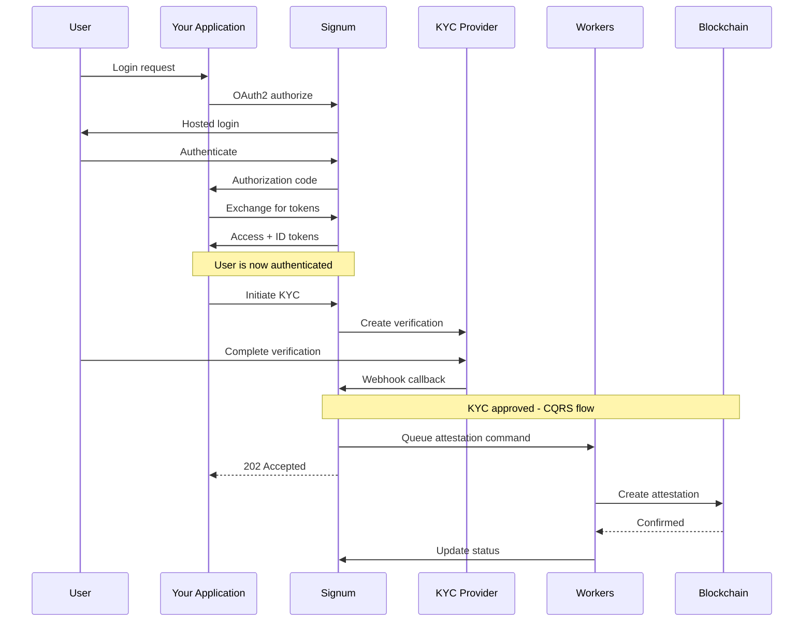

# Signum Identity Platform

Signum is an enterprise-grade **Federated Identity Provider** that bridges verified identities across blockchain networks. It provides a unified authentication layer with cryptographic attestations using a **CQRS event-driven architecture**.

<Frame>
  
</Frame>

## The Problem

Web3 identity is fragmented. Users maintain separate wallets, separate KYC verifications, and separate identities across every blockchain they interact with. For institutions, this means:

- **Repeated KYC** for every chain integration
- **No portable compliance** between networks  
- **Siloed identity data** that can't be verified cross-chain
- **Complex wallet management** for multi-chain operations

## The Solution

Signum provides a single identity layer that:

<CardGroup cols={2}>
  <Card title="Unified Authentication" icon="fingerprint">
    OAuth2/OIDC compliant auth that works with existing enterprise systems. One login, access to all chains.
  </Card>
  <Card title="Portable KYC" icon="shield-check">
    Verify once, attest everywhere. KYC attestations bridge automatically across supported blockchains.
  </Card>
  <Card title="Deterministic Wallets" icon="wallet">
    Program Derived Addresses (PDAs) on Solana tied to your identity. No seed phrases, no key management.
  </Card>
  <Card title="Enterprise Ready" icon="building">
    SOC2 compliant, institutional-grade infrastructure with rate limiting, audit logging, and revocation.
  </Card>
</CardGroup>

## Chain Support Roadmap



| Priority | Chain | Status | Features |
|----------|-------|--------|----------|
| 1 | **Solana** | Active | PDA wallets, Token-2022 transfer hooks, compliance enforcement |
| 2 | **EVM** | Next | Ethereum, Polygon, Base with ERC-3643 Identity Registry |
| 3 | **ARC** | Planned | Circle USDC chain integration |
| 4 | **Arch** | Planned | Bitcoin layer integration |

## How It Works



## CQRS Architecture

Signum uses Command Query Responsibility Segregation for reliable blockchain operations:

| Operation Type | HTTP Response | Behavior |
|----------------|---------------|----------|
| **Commands** | `202 Accepted` | Async execution via Kafka workers |
| **Queries** | `200 OK` | Direct database reads |

This ensures reliability and consistency even during blockchain congestion or failures.

## Core Concepts

<AccordionGroup>
  <Accordion title="Federated Identity">
    Signum acts as an OAuth2/OIDC identity provider. Your application redirects users to Signum for authentication, then receives verified identity claims in standard JWT format. Works with any OAuth2 client library.
  </Accordion>
  
  <Accordion title="Multi-Chain Identities">
    Each user has linked identities across chains: Solana PDAs, EVM wallet addresses. All tied to a single Signum identity with unified KYC status.
  </Accordion>
  
  <Accordion title="Attestations">
    Cryptographic proofs of identity verification anchored on-chain. When a user passes KYC, Signum creates attestations on all linked chains, enabling compliant DeFi, tokenized assets, and regulated transfers.
  </Accordion>
  
  <Accordion title="Program Derived Addresses (PDAs)">
    On Solana, wallet addresses are derived deterministically from user IDs. No private keys to manage—the program itself controls the wallet. Users can transact without seed phrases.
  </Accordion>

  <Accordion title="Event-Driven Workers">
    Infrastructure workers consume Kafka commands and execute blockchain operations asynchronously. This provides reliability, retries, and eventual consistency with the database.
  </Accordion>
</AccordionGroup>

## Quick Start

Get integrated in 5 minutes:

<Steps>
  <Step title="Get API Credentials">
    Register your application at [app.signum.id](https://app.signum.id) to receive your `client_id` and configure redirect URIs.
  </Step>
  
  <Step title="Implement OAuth2 Flow">
    Use any OAuth2 library to redirect users to Signum's authorization endpoint:
    ```
    https://api.signum.id/oauth/authorize?
      client_id=YOUR_CLIENT_ID&
      redirect_uri=https://yourapp.com/callback&
      response_type=code&
      scope=openid profile email chain:read
    ```
  </Step>
  
  <Step title="Exchange for Tokens">
    After authentication, exchange the authorization code for access and ID tokens.
  </Step>
  
  <Step title="Access Chain Identities">
    Use the access token to retrieve the user's linked wallets and attestation status.
  </Step>
</Steps>

<Card title="Full Quickstart Guide" icon="rocket" href="/quickstart">
  Step-by-step integration with code examples
</Card>

## Infrastructure

Signum is built on enterprise infrastructure with CQRS pattern:

| Component | Technology | Purpose |
|-----------|------------|---------|
| **API** | Elysia/Bun | Fast REST API with OpenAPI docs |
| **Workers** | Kafka consumers | Async blockchain operations |
| **Cache** | Dragonfly | Rate limiting, session storage |
| **Events** | Kafka/Redpanda | CQRS command/event bus |
| **Database** | Supabase (Postgres) | Identity storage with RLS |
| **Solana** | Helius | Enhanced RPC and event streaming |

See the [Architecture](/architecture) page for full CQRS infrastructure documentation.
