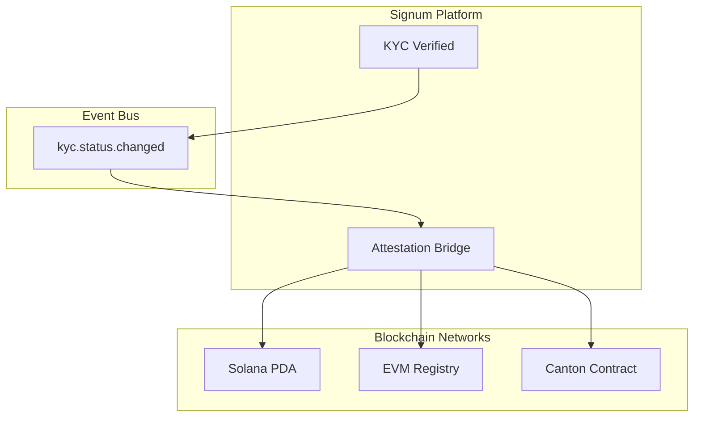
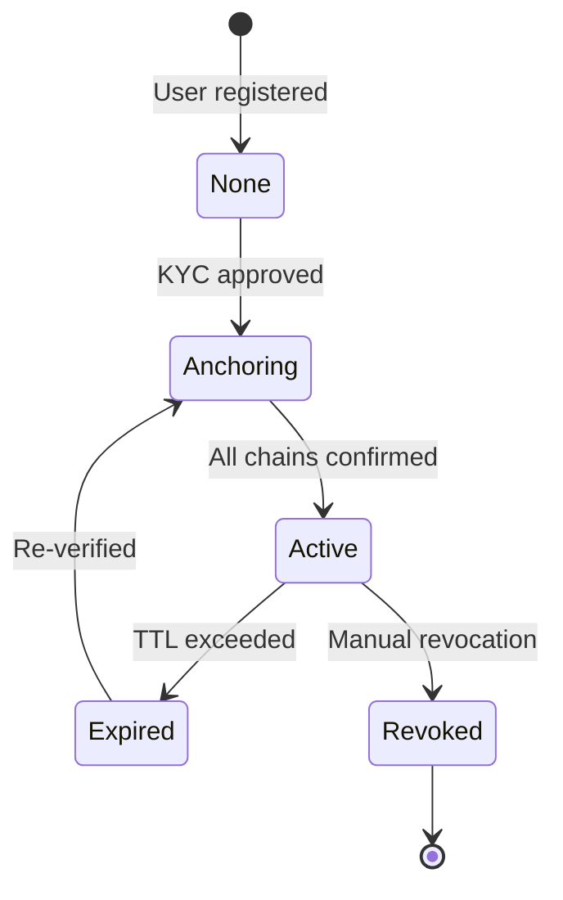

# Attestations

When a user passes KYC verification, Signum creates cryptographic attestations on all linked blockchain networks. These attestations enable compliant DeFi, tokenized assets, and regulated transfers.

## Attestation Architecture



## Attestation Data

Each attestation contains:

| Field | Type | Description |
|-------|------|-------------|
| `verified` | boolean | Whether KYC is currently valid |
| `level` | string | Verification level (basic, enhanced, institutional) |
| `verifiedAt` | timestamp | When verification was completed |
| `expiresAt` | timestamp | When attestation expires |
| `issuer` | address | Signum's signing key/party |

## Chain-Specific Implementations

### Solana

Attestations are stored as Anchor program accounts:

```rust
#[account]
pub struct KycAttestation {
    pub bump: u8,
    pub email_hash: [u8; 32],
    pub verified: bool,
    pub level: u8,           // 0: basic, 1: enhanced, 2: institutional
    pub verified_at: i64,    // Unix timestamp
    pub expires_at: i64,     // Unix timestamp
    pub issuer: Pubkey,
}
```

**Query attestation:**

```typescript
import { getKycStatusPDA } from '@signum/solana-sdk';

const [attestationPda] = getKycStatusPDA(emailHash, PROGRAM_ID);

const account = await connection.getAccountInfo(attestationPda);
if (account) {
  const attestation = parseKycAttestation(account.data);
  console.log('Verified:', attestation.verified);
  console.log('Level:', attestation.level);
}
```

### EVM

Attestations use the ERC-3643 Identity Registry pattern:

```solidity
interface IIdentityRegistry {
    function isVerified(address wallet) external view returns (bool);
    
    function getIdentity(address wallet) external view returns (
        bool verified,
        uint8 level,
        uint256 verifiedAt,
        uint256 expiresAt
    );
    
    event IdentityRegistered(
        address indexed wallet,
        uint8 level,
        uint256 verifiedAt,
        uint256 expiresAt
    );
    
    event IdentityRevoked(
        address indexed wallet,
        string reason
    );
}
```

**Query attestation:**

```typescript
import { createPublicClient, http } from 'viem';
import { mainnet } from 'viem/chains';

const client = createPublicClient({
  chain: mainnet,
  transport: http(),
});

const [verified, level, verifiedAt, expiresAt] = await client.readContract({
  address: REGISTRY_ADDRESS,
  abi: identityRegistryAbi,
  functionName: 'getIdentity',
  args: [walletAddress],
});

console.log('Verified:', verified);
console.log('Level:', level);
```

### Canton

Attestations are DAML contracts:

```daml
template KycAttestation
  with
    issuer : Party
    subject : Party
    verified : Bool
    level : Text
    verifiedAt : Time
    expiresAt : Time
  where
    signatory issuer
    observer subject
```

**Query via Ledger API:**

```typescript
const contracts = await ledgerClient.activeContracts({
  templateId: 'Signum.Kyc:KycAttestation',
  party: partyId,
});

const attestation = contracts[0];
console.log('Verified:', attestation.verified);
```

## Attestation Lifecycle



### Creation

When KYC is approved:

1. **Event published**: `kyc.status.changed` with `status: approved`
2. **Parallel anchoring**: Attestation Bridge creates attestations on all chains
3. **Confirmation**: Chain adapters publish confirmation events
4. **Database sync**: `attestation_anchors` table updated

### Expiration

Attestations have a default TTL of 1 year. When expired:

- **Token transfers blocked** (if using transfer hooks)
- **User prompted to re-verify**
- **Automatic cleanup** of on-chain data (optional)

### Revocation

Attestations can be revoked for:

- **Fraud detection**: User flagged for suspicious activity
- **Compliance**: Regulatory requirement
- **User request**: GDPR right to erasure

```typescript
// Admin API (requires elevated permissions)
await signum.admin.revokeAttestation(userId, {
  reason: 'Fraud detected',
  chains: ['solana', 'evm', 'canton'],
});
```

## Cross-Chain Verification

Third parties can verify attestations on any chain:

```typescript
// Verify on Solana
const solanaVerified = await signum.solana.verifyAttestation(walletAddress);

// Verify on EVM
const evmVerified = await registryContract.isVerified(walletAddress);

// Verify via Signum API (all chains)
const status = await fetch(
  `https://api.signum.id/public/verify/${walletAddress}`
).then(r => r.json());

console.log(status);
// {
//   verified: true,
//   chains: {
//     solana: { verified: true, anchoredAt: "..." },
//     evm: { verified: true, chainIds: [1, 137] },
//     canton: { verified: true, contractId: "..." }
//   }
// }
```

## Event Monitoring

Subscribe to attestation events:

```typescript
import { Kafka } from 'kafkajs';

const consumer = kafka.consumer({ groupId: 'my-verifier' });

await consumer.subscribe({ topics: [
  'attestation.created',
  'attestation.revoked',
  'chain.solana.events',
  'chain.evm.events',
  'chain.canton.events',
]});

await consumer.run({
  eachMessage: async ({ topic, message }) => {
    const event = JSON.parse(message.value.toString());
    
    switch (topic) {
      case 'attestation.created':
        console.log(`New attestation for ${event.userId}`);
        break;
      case 'attestation.revoked':
        console.log(`Attestation revoked: ${event.reason}`);
        break;
    }
  },
});
```

## Security Model

<CardGroup cols={2}>
  <Card title="Issuer Authority" icon="key">
    Only Signum can create and revoke attestations. Issuer keys are HSM-protected.
  </Card>
  <Card title="Tamper Proof" icon="shield">
    On-chain attestations cannot be modified without valid authority signatures.
  </Card>
  <Card title="Privacy" icon="eye-slash">
    Email hashes used instead of plaintext. PII never stored on-chain.
  </Card>
  <Card title="Auditability" icon="clipboard-list">
    All attestation operations logged with timestamps and transaction hashes.
  </Card>
</CardGroup>
