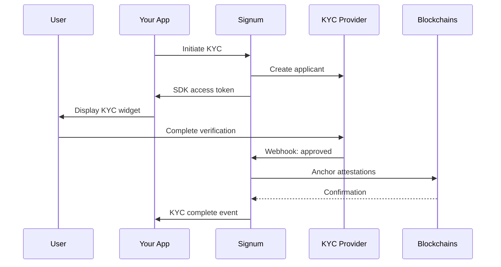

# KYC & Compliance

Signum integrates with enterprise KYC providers to verify user identities and anchor attestations across blockchain networks.

## How It Works



## Verification Levels

| Level | Requirements | Use Cases |
|-------|--------------|-----------|
| **Basic** | Email + Phone verification | Platform access |
| **Enhanced** | ID document + Liveness check | Trading, transfers |
| **Institutional** | Full due diligence + corporate docs | High-value transactions |

## KYC Provider

Signum currently integrates with [Sumsub](https://sumsub.com) for identity verification:

| Feature | Description |
|---------|-------------|
| **Document Verification** | 14,000+ ID types from 220+ countries |
| **Liveness Detection** | AI-powered face matching |
| **AML Screening** | Real-time sanctions and PEP checks |
| **Fraud Prevention** | Device fingerprinting, IP analysis |
| **Compliance** | GDPR, SOC2, ISO 27001 certified |

<Note>
  The KYC provider is configurable. Contact us for enterprise custom integrations.
</Note>

## Integration Flow

### 1. Initiate Verification

```typescript
const response = await fetch('/kyc/initiate', {
  method: 'POST',
  headers: {
    Authorization: `Bearer ${accessToken}`,
    'Content-Type': 'application/json',
  },
  body: JSON.stringify({
    level: 'enhanced',
    userInfo: {
      firstName: 'John',
      lastName: 'Doe',
      email: 'john@example.com',
    },
  }),
});

const { applicantId, accessToken: sdkToken, sdkUrl } = await response.json();
```

### 2. Display KYC Widget

```html
<script src="https://static.sumsub.com/websdk/v2/sumsub-sdk.js"></script>
<script>
  const sdk = snsWebSdk
    .init(sdkToken, () => fetch('/kyc/refresh-token').then(r => r.json()))
    .withConf({ lang: 'en' })
    .withOptions({ addViewportTag: true })
    .on('onComplete', (data) => {
      console.log('KYC complete:', data);
    })
    .build();
    
  sdk.launch('#sumsub-container');
</script>
```

### 3. Handle Webhook

Signum receives webhooks from the KYC provider and:

1. Updates the user's verification status
2. Publishes `kyc.status.changed` to Kafka
3. Triggers attestation anchoring on all chains

### 4. Check Status

```typescript
const status = await fetch('/kyc/status', {
  headers: { Authorization: `Bearer ${accessToken}` },
}).then(r => r.json());

console.log(status);
// {
//   verified: true,
//   level: 'enhanced',
//   verifiedAt: '2026-01-15T12:00:00Z',
//   expiresAt: '2027-01-15T12:00:00Z'
// }
```

## Attestation Anchoring

When KYC is approved, attestations are created on all linked chains:

| Chain | Attestation Type | Location |
|-------|------------------|----------|
| Solana | KycAttestation account | PDA derived from email hash |
| EVM | Registry entry | IdentityRegistry contract |
| Canton | DAML contract | KycAttestation template |

## Development Mode

For development, use the mock KYC provider:

```bash
# In your .env
KYC_PROVIDER=mock
```

Mock endpoints for testing:

```bash
# Approve a user
POST /kyc/mock/approve
Authorization: Bearer YOUR_TOKEN

# Reject a user
POST /kyc/mock/reject
Authorization: Bearer YOUR_TOKEN
Content-Type: application/json

{
  "reason": "Document expired"
}
```

## Next Steps

<CardGroup cols={2}>
  <Card title="Verification Flow" icon="id-card" href="/kyc/verification-flow">
    Detailed implementation guide
  </Card>
  <Card title="Attestations" icon="certificate" href="/kyc/attestations">
    How attestations are anchored
  </Card>
</CardGroup>
