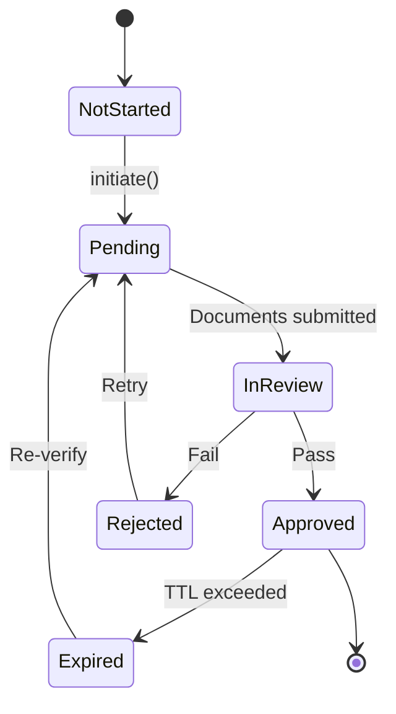

# Verification Flow

This guide covers the complete KYC verification flow from initiation to attestation.

## Prerequisites

- User must be authenticated with Signum
- Application must have `kyc:initiate` scope
- KYC provider credentials configured (production only)

## Step 1: Check Existing Status

Before initiating, check if the user is already verified:

```typescript
const status = await signum.kyc.getStatus(accessToken);

if (status.verified) {
  console.log(`Already verified at level: ${status.level}`);
  return;
}

if (status.pending) {
  console.log('Verification in progress');
  // Show status or resume flow
  return;
}
```

## Step 2: Initiate Verification

Request a new verification session:

<CodeGroup>
```typescript TypeScript
const response = await fetch('https://api.signum.id/kyc/initiate', {
  method: 'POST',
  headers: {
    Authorization: `Bearer ${accessToken}`,
    'Content-Type': 'application/json',
  },
  body: JSON.stringify({
    level: 'enhanced',
    userInfo: {
      firstName: 'John',
      lastName: 'Doe',
      email: 'john@example.com',
      phone: '+1234567890',
      dateOfBirth: '1990-01-15',
      country: 'US',
    },
  }),
});

const verification = await response.json();
```

```bash cURL
curl -X POST https://api.signum.id/kyc/initiate \
  -H "Authorization: Bearer YOUR_TOKEN" \
  -H "Content-Type: application/json" \
  -d '{
    "level": "enhanced",
    "userInfo": {
      "firstName": "John",
      "lastName": "Doe",
      "email": "john@example.com"
    }
  }'
```
</CodeGroup>

**Response:**

```json
{
  "applicantId": "6789abcdef",
  "accessToken": "sumsub_sdk_token...",
  "sdkUrl": "https://websdk.sumsub.com/...",
  "expiresAt": "2026-01-15T13:00:00Z"
}
```

## Step 3: Display Verification UI

### Option A: Sumsub Web SDK (Recommended)

```html
<!DOCTYPE html>
<html>
<head>
  <script src="https://static.sumsub.com/websdk/v2/sumsub-sdk.js"></script>
</head>
<body>
  <div id="sumsub-container"></div>
  
  <script>
    async function launchKyc(sdkToken) {
      const sdk = snsWebSdk
        .init(sdkToken, async () => {
          // Refresh token if needed
          const res = await fetch('/api/kyc/refresh-token');
          return res.json().then(d => d.accessToken);
        })
        .withConf({
          lang: 'en',
          theme: 'dark',
        })
        .withOptions({
          addViewportTag: true,
          adaptIframeHeight: true,
        })
        .on('onComplete', (data) => {
          console.log('Verification complete:', data);
          // Redirect or show success
        })
        .on('onError', (error) => {
          console.error('Verification error:', error);
        })
        .on('onMessage', (type, payload) => {
          console.log('SDK message:', type, payload);
        })
        .build();
        
      sdk.launch('#sumsub-container');
    }
    
    // Get SDK token from your backend
    fetch('/api/kyc/init')
      .then(r => r.json())
      .then(d => launchKyc(d.accessToken));
  </script>
</body>
</html>
```

### Option B: Redirect Flow

For mobile apps or when embedding isn't possible:

```typescript
// Redirect user to KYC URL
window.location.href = verification.sdkUrl;

// Configure return URL in Signum dashboard
// User will be redirected back after completion
```

## Step 4: Handle Webhooks

Signum receives webhooks from the KYC provider automatically. Your application can:

### A. Poll for Status

```typescript
async function pollKycStatus(accessToken: string): Promise<void> {
  const status = await signum.kyc.getStatus(accessToken);
  
  if (status.pending) {
    // Still processing, poll again
    setTimeout(() => pollKycStatus(accessToken), 5000);
    return;
  }
  
  if (status.verified) {
    console.log('Verification complete!');
    // Proceed with authenticated flow
  } else if (status.rejected) {
    console.log('Verification failed:', status.rejectionReason);
    // Handle rejection
  }
}
```

### B. Listen to Kafka Events

For backend services:

```typescript
import { Kafka } from 'kafkajs';

const kafka = new Kafka({ brokers: ['localhost:9092'] });
const consumer = kafka.consumer({ groupId: 'my-app' });

await consumer.subscribe({ topic: 'kyc.status.changed' });

await consumer.run({
  eachMessage: async ({ message }) => {
    const event = JSON.parse(message.value.toString());
    
    if (event.status === 'approved') {
      console.log(`User ${event.userId} approved`);
      // Trigger business logic
    }
  },
});
```

## Step 5: Access Attestations

After verification, attestations are available:

```typescript
const account = await signum.accounts.getAll(accessToken);

// Solana attestation
console.log(account.chains.solana.attestation);
// {
//   verified: true,
//   address: "5Gh7...",
//   anchoredAt: "2026-01-15T12:05:00Z"
// }

// EVM attestation
console.log(account.chains.evm.attestation);
// {
//   verified: true,
//   contract: "0x1234...",
//   chainIds: [1, 137, 42161]
// }
```

## Verification Status States



| Status | Description |
|--------|-------------|
| `not_started` | User hasn't initiated KYC |
| `pending` | Verification in progress |
| `in_review` | Documents submitted, under review |
| `approved` | Verification passed |
| `rejected` | Verification failed |
| `expired` | Verification expired |

## Handling Rejections

When verification fails:

```typescript
const status = await signum.kyc.getStatus(accessToken);

if (status.rejected) {
  console.log('Rejection reason:', status.rejectionReason);
  // Possible reasons:
  // - "Document expired"
  // - "Face mismatch"
  // - "Document unreadable"
  // - "Fraud suspected"
  
  // Allow retry if appropriate
  if (status.canRetry) {
    await signum.kyc.initiate(accessToken, { level: 'enhanced' });
  }
}
```

## Security Considerations

<Warning>
  Never expose the KYC applicant ID or SDK token to unauthorized users. These should only be used for the intended user's session.
</Warning>

- **Token expiry**: SDK tokens expire after 1 hour
- **One-time use**: Verification sessions are single-use
- **Rate limiting**: KYC initiation is rate-limited to prevent abuse
- **PII handling**: User info is encrypted in transit and at rest
